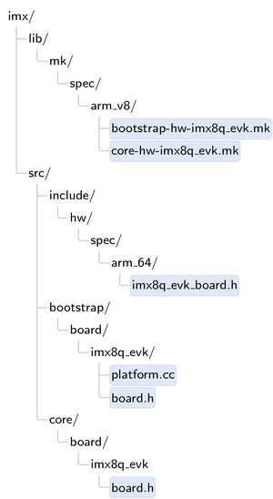
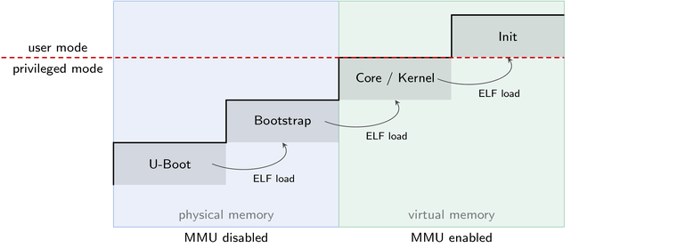

# Pineを楽しむ - カーネルスケルトン

[January 28 2021 by Norman Feske](https://genodians.org/nfeske/2021-01-28-pine-fun-kernel-skeleton)

Genode OSフレームワークがサポートするカーネルの中で、いわゆるbase-hwカーネルは
ARMベースのデバイスのための主力マイクロカーネルです。Genode Foundations bookの
[ベアハードウェア上の実行](https://genode.org/documentation/genode-foundations/20.05/under_the_hood/Execution_on_bare_hardware_(base-hw).html)の節にはその基本的な
ソフトウェア設計について詳しく書かれています。この記事では、このカーネルを新しい
ボード、特に[Pine-A64-LTS](https://pine64.com/product-category/pine-a64-ltslong-term-supply/)
シングルボードコンピュータに移植するプロセスを説明します。

[前回の記事](baremetal.md)で開発したベアメタルシリアル出力機能を装備したので
私たちはカーネルに目を向けることを熱望しています。しかし、新しいボードへの
カーネルの移植を試みる前にまず、すでにサポートされているボードでカーネルを
実行して実際に動作するリファレンスを得ることを推奨します。Allwinnerマルチコア
64ビットARM SoCをベースとするPine-A64ボードの場合、最も近いのはARM、マルチコア、
64ビットの条件を満たすNXP i.MX8Q EVKボードです。少なくとも、32ビットプラット
フォームであるQemuのvirtual pbxa9ボードを使ってカーネルを試してみるべきです。
このボードは私たちのボードとあまり共通点はありませんが、以下に説明するさまざまな
断片がどのように連携して動作するかを確認するのに役立ちます。

## コードベースを知る

私たちの作業の出発点はすでに存在するi.MX8Q EVKのボードサポートです。今後の
作業量を把握するために、Genode内のbase-hwソースツリーからボード名を検索して
みます。検索パターン"imx"を使うのは良いスタートです。

```bash
$ find repos/base-hw -type f | grep imx8
repos/base-hw/lib/mk/spec/arm_v8/core-hw-imx8q_evk.mk
repos/base-hw/lib/mk/spec/arm_v8/bootstrap-hw-imx8q_evk.mk
repos/base-hw/recipes/src/base-hw-imx8q_evk/hash
repos/base-hw/recipes/src/base-hw-imx8q_evk/content.mk
repos/base-hw/recipes/src/base-hw-imx8q_evk/used_apis
repos/base-hw/src/bootstrap/board/imx8q_evk/platform.cc
repos/base-hw/src/bootstrap/board/imx8q_evk/board.h
repos/base-hw/src/include/hw/spec/arm_64/imx8q_evk_board.h
repos/base-hw/src/core/board/imx8q_evk/board.h
```

とりあえず *recipes/* ディレクトリのファイルはすべて無視することができます。
このディレクトリにはパッケージの説明が含まれています。パッケージの話題については
後で触れます。`grep -v`でこれらのファイルは見えなくなります。

```bash
$ find repos/base-hw -type f | grep imx8 | grep -v recipes
repos/base-hw/lib/mk/spec/arm_v8/core-hw-imx8q_evk.mk
repos/base-hw/lib/mk/spec/arm_v8/bootstrap-hw-imx8q_evk.mk
repos/base-hw/src/bootstrap/board/imx8q_evk/platform.cc
repos/base-hw/src/bootstrap/board/imx8q_evk/board.h
repos/base-hw/src/include/hw/spec/arm_64/imx8q_evk_board.h
repos/base-hw/src/core/board/imx8q_evk/board.h
```

気になるファイルの数がこれほど少ないのは良いことですが、その一方で、これらの
ファイルはソースツリー全体にかなり散らばっているようであり、階層も深いため、
少し混乱します。雲を晴らすために、ソースツリーの構造を見てみます。



*lib/mk/* 配下にあるファイルはライブラリのビルド記述ファイルです。このような
ファイルは2つあり、ファイル拡張子は.mkです。これらのファイルは*spec/arm_v8/*と
いうサブディレクトリにあり、ARMv8に一致する命令セットアーキテクチャ用にビルド
際にだけ[ビルドシステム](https://genode.org/documentation/genode-foundations/20.05/development/Build_system.html)が考慮するようになっています。

### bootstrapとcoreの違い

上の図でファイルが指定されたのですぐに"bootstrap"と"core"という2つの構築箇所を
見つけることができます。この2つの違いを次の図に示します。



**bootstrap**プログラムはブートローダにより開始されます。CPUは物理モードで
動作しており、この時点ではMMUは無効になっています。通常、ブートCPUと呼ばれて
いる1つのCPUだけがアクティブです。bootstrapは、いわゆるcoreコンポーネント
を立ち上げる準備に必要な汚くて奇妙な作業をすべて行います。これにはクロックや
電圧の調整、仮想メモリでcoreプログラムを実行するためのページテーブルのセット
アップ、MMUの有効化、ブート以外のCPUコアの初期化、コアELF実行ファイルのELF
ロードなど、ボード固有の処理が含まれます。これらのステップを実行するとブート
ストラップはcoreコンポーネントに制御を渡し、存在を終えます。

**core**コンポーネントには特権モードで実行されるマイクロカーネルが含まれます。NOVAやseL4のような伝統的なマイクロカーネル上でGenodeを使用する場合、coreは
カーネルによって起動される最初のユーザレベルプログラムです。これは通常roottaskと
呼ばれます。対照的に、これからやろうとしているようにbase-hwを使う場合はcoreと
カーネルはひとつのプログラムです。coreはGenodeのコンポーネントツリーのルートに
あるマイクロカーネル*です*。したがって、以下ではcoreとカーネルという用語は同じ
意味で使用されています。

coreはMMUを有効にして実行されます。仮想アドレス空間の上位部分にグローバルに
マッピングされます。カーネルとして動作するために次の機能のための基本的なドライバを含んでいます: 割り込みコントローラ、（プリエンプティブなスケジューリングの
ための）カーネルタイマー、キャッシュンテナンス、CPU間の同期です。core上で動作
するユーザレベルのコンポーネントとの相互作用のために、カーネルからユーザ
ランドに出るためのコードパスと、逆にユーザランドからカーネルに入るためのコード
パス（システムコール、例外、割り込み）を備えています。機能面では、コンポーネント
間通信、非同期通知、物理メモリの割り当て、仮想アドレス空間の管理、仮想マシン間の
世界の切り替え（ハイパーバイザとして使用する場合）などのメカニズムが実装されて
ます。要するに、マイクロカーネルがするべきことのすべてであり、さらに重要な
ことは、マイクロカーネルがすべきでないことは何もないということです。

### ボード固有のコードのレビュー

新しいボードのサポート作業を始める前に既存のi.MX8q EVKボード用の各ファイルを
簡単に調べてみます。GenodeにおけるNXP i.MXファミリーのサポートは専用の
[genode-imxリポジトリ](https://github.com/genodelabs/genode-imx)でホストされて
います。ボードの名前にちなんだファイルに注目してみます。

```bash
repos/imx$ find | grep imx8q_evk
```

ファイルリストの中に3つのヘッダーファイルを見つけました。*src/bootstrap/* 配下の
*board.h*ヘッダー、*src/core/* 配下のboard.hヘッダー、*src/include/* 配下の
*imx8q_evk_board.h* ヘッダーです。前者2つのファイルは各々bootstrapとcoreに固有の
ヘッダーですが、後者には両方のプログラムに有用な定義が含まれています。*board.h*
ファイルはボードにちなんだ名前のディレクトリに配置されています。この構造により
一般的な（ボードに依存しない）コードは`#include <board.h>`とすることができます。
ビルドシステムはincludeサーチパスにボード固有のディレクトリを追加することで
正しい*board.h*ファイルを選択します。

bootstrapとcoreで使用される定義から見ていきます。

*repos/imx/src/include/hw/spec/arm_64/imx8q_evk_board.h*

```c
#include <drivers/uart/imx.h>
#include <hw/spec/arm/boot_info.h>

namespace Hw::Imx8q_evk_board {
    using Serial = Genode::Imx_uart;

    enum {
        RAM_BASE   = 0x40000000,
        RAM_SIZE   = 0xc0000000,

        UART_BASE  = 0x30860000,
        UART_SIZE  = 0x1000,
        UART_CLOCK = 250000000,
    };

    namespace Cpu_mmio {
        enum {
            IRQ_CONTROLLER_DISTR_BASE  = 0x38800000,
            IRQ_CONTROLLER_DISTR_SIZE  = 0x10000,
            IRQ_CONTROLLER_VT_CPU_BASE = 0x31020000,
            IRQ_CONTROLLER_VT_CPU_SIZE = 0x2000,
            IRQ_CONTROLLER_REDIST_BASE = 0x38880000,
            IRQ_CONTROLLER_REDIST_SIZE = 0xc0000,
        };
    };
 }
```

bootstrapとcoreは両者とも診断メッセージを表示するためにUARTデバイスのメモリ
マップドデバイスレジスタを知る必要があります。UARTドライバ
(*drivers/uart.imx.h*) が含まれています。`Serial`型は、ボード上に存在する
具体的なUARTドライバの実装を指します。この定義のおかげで、汎用コードは型名
`Serial`を介してそのUART機能に依存することができます。

物理メモリの開始とサイズはbootstrapもcoreも知っている必要があります。そのため、
ここで定義されます。

bootstrapもcoreも割り込みコントローラにアクセスします。bootstrapはセカンダリ
CPUコアを起動するために必要な1回限りの初期化を実行するのに対して、 coreは
実行時に割り込みコントローラを駆動します。

bootstrap特有のファイルはビルド記述と実際のコードに関するものです。ビルド記述は
次のようなものです。

*repos/imx/lib/mk/spec/arm_v8/bootstrap-hw-imx8q_evk.mk*

```makefile
REP_INC_DIR += src/bootstrap/board/imx8q_evk

SRC_CC  += bootstrap/board/imx8q_evk/platform.cc
SRC_CC  += bootstrap/spec/arm/gicv3.cc
SRC_CC  += bootstrap/spec/arm_64/cortex_a53_mmu.cc
SRC_CC  += lib/base/arm_64/kernel/interface.cc
SRC_CC  += spec/64bit/memory_map.cc
SRC_S   += bootstrap/spec/arm_64/crt0.s

NR_OF_CPUS = 4

vpath spec/64bit/memory_map.cc $(call select_from_repositories,src/lib/hw)

vpath bootstrap/% $(REP_DIR)/src

include $(call select_from_repositories,lib/mk/bootstrap-hw.inc)
```

i.MX8 SoCは割り込みコントローラとしてGICv3を使用しています。そのため、
ドライバgicv3.ccが含まれています。一方、Linuxのブートログから知ったように
Allwinner A64 SoCはGICv2割り込みコントローラを使用しています。

MMUドライバはARMのバージョンによりで異なります。i.MX8はA53 CPUコアをベースと
しています。Allwinner A64も同じものを使用しています。

アセンブリファイル *arm_64/crt0.s* には、ブートローダからジャンプする
プログラムのエントリーポイントが含まれています。

`NR_OF_CPUS`定義は各CPUに存在しなければならないデータ構造の静的割り当てに
使用されます。そのためこの値はグローバルに定義されています。

奇妙な`$(call select_from_repositories...)`は様々なソースリポジトリにまたがる
ファイルにアクセスするためのメカニズムです。このメカニズムについては
[マニュアル](https://genode.org/documentation/genode-foundations/20.05/development/Build_system.html)を参照してください。

*repos/imx/src/bootstrap/board/imx8q_evk/board.h*

```c
#include <hw/spec/arm_64/imx8q_evk_board.h>
#include <hw/spec/arm_64/cpu.h>
#include <hw/spec/arm/gicv3.h>
#include <hw/spec/arm/lpae.h>

namespace Board {
    using namespace Hw::Imx8q_evk_board;

    struct Cpu : Hw::Arm_64_cpu
    {
        static void wake_up_all_cpus(void*);
    };

    using Hw::Pic;
}
```

`Board`名前空間はbootstrapコードにとって重要なボードの詳細情報、すなわち、
特定の割り込みコントローラ（gicv3.h）と`wake_up_all_cpus`関数の宣言を集約
します。`Board`名前空間は`Pic`（プログラマブル割り込みコントローラ）型を
ホストし、これによりブートストラップの汎用コードはデバイスの正確なタイプを
知らなくても割り込みコントローラと対話できるようになります。

*repos/imx/src/bootstrap/board/imx8q_evk/platform.cc*

```cc
Bootstrap::Platform::Board::Board()
:
early_ram_regions(Memory_region { ::Board::RAM_BASE, ::Board::RAM_SIZE }),
late_ram_regions(Memory_region { }),
core_mmio(Memory_region { ::Board::UART_BASE, ::Board::UART_SIZE },
            Memory_region { ::Board::Cpu_mmio::IRQ_CONTROLLER_DISTR_BASE,
                            ::Board::Cpu_mmio::IRQ_CONTROLLER_DISTR_SIZE },
            Memory_region { ::Board::Cpu_mmio::IRQ_CONTROLLER_REDIST_BASE,
                            ::Board::Cpu_mmio::IRQ_CONTROLLER_REDIST_SIZE })
{
    ::Board::Pic pic {};

    ... incomprehensible magic spells, some gibberish about GPIO, CCM, PLL ...
}

void Board::Cpu::wake_up_all_cpus(void * ip)
{
    ... more magic spells, digressing into assembly code ...
}
```

`early_ram_regions`、`late_ram_regions`、`core_mmio`のデータ構造体は基地の
物理メモリ範囲とメモリマップドI/Oレジスタ範囲で初期化されます。この情報はさらに
コアに渡されるように指定されています。

`Board::Pic pic {};` を呼び出すことで一度だけ必要な基本的な割り込みコントローラの
初期化を実行しています。続いて、ボードをカーネルが依存する定義された状態にする
ために一連のボード固有の微調整を行います。たとえば、I/O MUXの構成、デフォルト
電圧や周波数の設定などです。U-bootブートローダがすでにベースラインを確立する
ための素晴らしい仕事をしていますが、かなり保守的です。i.MX8 EVKのコードでは
パフォーマンスを向上させるために電圧と周波数を上げています。

`wake_up_all_cpus`を呼び出してセカンダリCPUコアを有効にするフックを実行します。
これに使用されるメカニズムはボードによって異なり、特にARMトラステッドファーム
ウェアの動作に依存します。マルチプロセッサのサポートを検討する際にはある程度の
調査が必要であることを覚悟する必要があります。ただし、最初のうちは、ブートCPU
しか使わないので、今のところこの関数を無視することができます。

最後に、コア固有のファイルに目を向けよう。

*repos/imx/lib/mk/spec/arm_v8/core-hw-imx8q_evk.mk*

```makefile
REP_INC_DIR += src/core/board/imx8q_evk
REP_INC_DIR += src/core/spec/arm/virtualization

# add C++ sources
SRC_CC += kernel/vm_thread_on.cc
SRC_CC += spec/arm/gicv3.cc
SRC_CC += spec/arm_v8/virtualization/kernel/vm.cc
SRC_CC += spec/arm/virtualization/platform_services.cc
SRC_CC += spec/arm/virtualization/vm_session_component.cc
SRC_CC += vm_session_common.cc
SRC_CC += vm_session_component.cc

#add assembly sources
SRC_S += spec/arm_v8/virtualization/exception_vector.s

NR_OF_CPUS = 4

# include less specific configuration
include $(call select_from_repositories,lib/mk/spec/arm_v8/core-hw.inc)
```

Coreは実行時に割り込みを処理するため割り込みコントローラのタイプを知る必要が
あります。ここではGICv3ドライバが組み込まれています。

bootstrapと同様に、core内のいくつかのデータ構造が各CPUに対して静的に割り当て
られるため、ここでもNR_OF_CPUSを指定する必要があります。

`vm_*`と`virtualization`がファイル名に含まれているファイルは今のところ無視
することができます。これらは仮想マシンをホストするために重要です。仮想化
サポートはARM CPUの汎用的な機能であるため、ボード固有の予防措置を講じる
必要はありません。

*repos/imx/src/core/board/imx8q_evk/board.h*

```c
#include <hw/spec/arm_64/imx8q_evk_board.h>
#include <spec/arm/generic_timer.h>
#include <spec/arm/virtualization/gicv3.h>
#include <spec/arm_v8/cpu.h>
#include <spec/arm_64/cpu/vm_state_virtualization.h>
#include <spec/arm/virtualization/board.h>

namespace Board {
    using namespace Hw::Imx8q_evk_board;

    enum {
        TIMER_IRQ           = 14 + 16,
        VT_TIMER_IRQ        = 11 + 16,
        VT_MAINTAINANCE_IRQ = 9  + 16,
        VCPU_MAX            = 16
    };
}
```

汎用タイマドライバのように、ボードとSoCにマッチしたヘッダの集約に加え、
コアにとって重要な数個の割り込み番号の定義が見られます。カーネルは他の
すべての周辺デバイスについては完全に無視しています。

VCPU_MAXの定義は仮想マシンで仮想CPUの状態を保持する配列のサイズを決める
ために使用されるだけです。今のところ重要ではありません。
