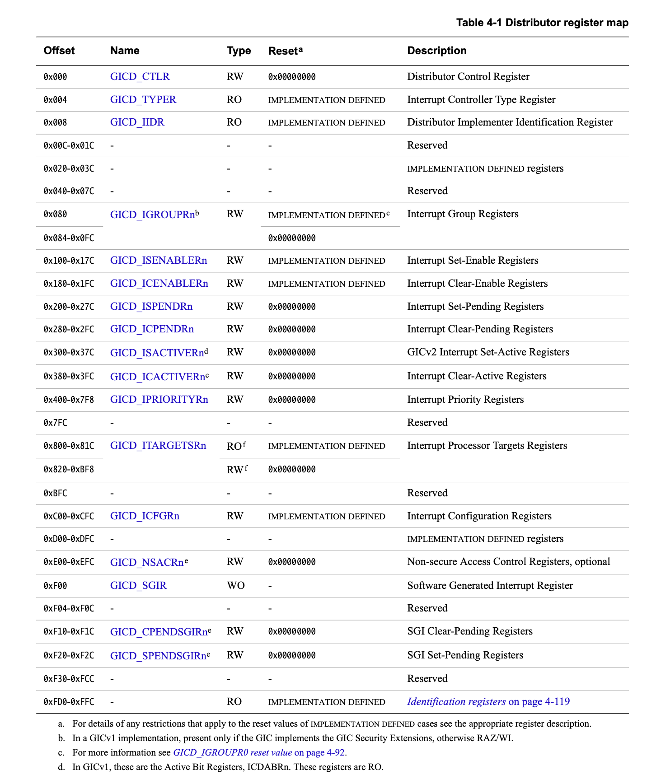
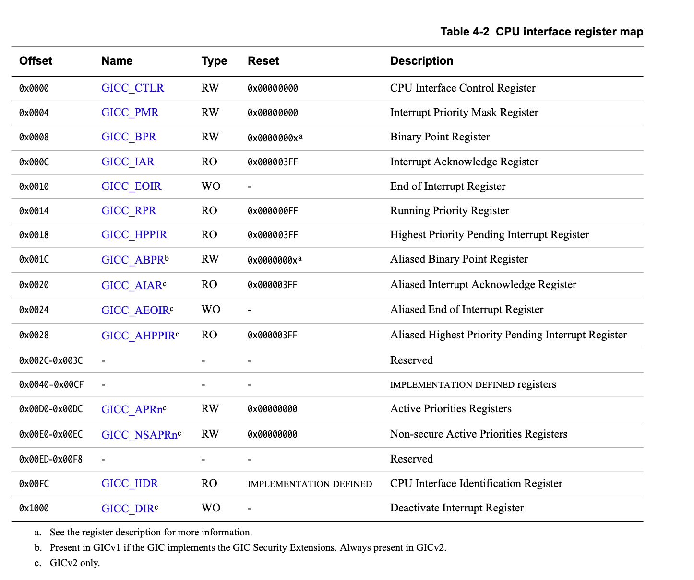

# [ARM® Generic Interrupt Controller アーキテクチャマニュアル : バージョン 2.0](file:///Volumes/wdb/docs/pine64/arm_gic_architecture_specification_v2.pdf)

## 第4章 プログラマモデル

### 4.3 ディストリビュータレジスタ記述

### 4.4 CPUインタフェースレジスタ記述

