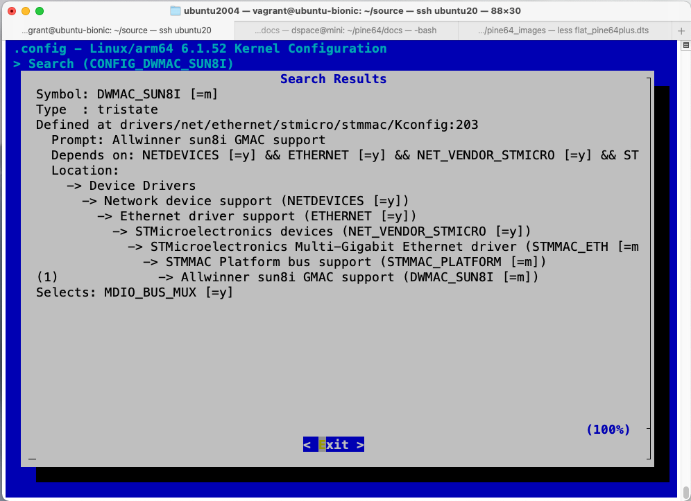

# U-BootからLinuxを実行

[Pineを楽しむ - Linuxを散歩に連れ出す](../genodians/taking_linux.md)を手元の
環境で再現してみる。

## U-Bootを使用したLinuxのブートストラップ

### armbianから必要なファイルを抽出

```bash
$ sudo mount -oloop,offset=4194304 Armbian_23.8.1_Pine64_bookworm_current_6.1.47.img /mnt
$ ls -l /mnt/boot
total 61288
-rw-r--r-- 1 1014 1014      155 Aug 31 23:35 armbianEnv.txt
-rw-r--r-- 1 root root     1536 Aug 31 23:34 armbian_first_run.txt.template
-rw-r--r-- 1 root root   230454 Aug 31 23:33 boot.bmp
-rw-r--r-- 1 1014 1014     3187 Aug 31 23:28 boot.cmd
-rw-rw-r-- 1 root root     3259 Aug 31 23:35 boot.scr
-rw-r--r-- 1 root root   207780 Aug 30 11:05 config-6.1.47-current-sunxi64
lrwxrwxrwx 1 root root       26 Aug 31 23:32 dtb -> dtb-6.1.47-current-sunxi64
drwxr-xr-x 3 root root     4096 Aug 31 23:32 dtb-6.1.47-current-sunxi64
lrwxrwxrwx 1 root root       30 Aug 31 23:32 Image -> vmlinuz-6.1.47-current-sunxi64
-rw-r--r-- 1 root root 18215873 Aug 31 23:38 initrd.img-6.1.47-current-sunxi64
-rw-r--r-- 1 root root  3464899 Aug 30 11:05 System.map-6.1.47-current-sunxi64
lrwxrwxrwx 1 root root       30 Aug 31 23:38 uInitrd -> uInitrd-6.1.47-current-sunxi64
-rw-r--r-- 1 root root 18215937 Aug 31 23:38 uInitrd-6.1.47-current-sunxi64
-rw-r--r-- 1 root root 22390792 Aug 30 11:05 vmlinuz-6.1.47-current-sunxi64
$ mkdir armbian && cd armbian
$ cp /mnt/boot/Image .
$ cp /mnt/boot/initrd.img-6.1.47-current-sunxi64 initrd
$ cp /mnt/boot/dtb/allwinner/sun50i-a64-pine64-plus.dtb pine64.dtb
$ ls -l
total 39704
-rw-r--r-- 1 vagrant vagrant 22390792 Sep 10 09:37 Image
-rw-r--r-- 1 vagrant vagrant 18215937 Sep 10 09:40 intrd
-rw-r--r-- 1 vagrant vagrant    41919 Sep 10 09:39 pine64.dtb
$ sudo umount /mnt
```

### ファイルをMacのtftpdディレクトリにコピー

```bash
$ cd /private/tftpboot
$ sudo scp ubuntu:$HOME/armbian/* .
```

### U-bootを実行

- カーネルパニック

```bash
...
=> setenv lx 'bootp 0x43000000 192.168.10.103:Image; bootp 0x41000000 192.168.10.103:initrd; \
> bootp 0x42f00000 192.168.10.103:pine64.dtb; fdt addr 0x42f00000; fdt resize 0x1000; \
> fdt set /chosen bootargs "rdinit=/bin/sh"; booti 0x43000000 - 0x42f00000;'
=> printenv lx
lx=bootp 0x43000000 192.168.10.103:Image; bootp 0x41000000 192.168.10.103:initrd;
bootp 0x42f00000 192.168.10.103:pine64.dtb; fdt addr 0x42f00000; fdt resize 0x1000;
fdt set /chosen bootargs "rdinit=/bin/sh"; booti 0x43000000 - 0x42f00000;
=> saveenv
Saving Environment to FAT... OK
=> run lx
...
Starting kernel ...

[    0.000000] Booting Linux on physical CPU 0x0000000000 [0x410fd034]
[    0.000000] Linux version 6.1.47-current-sunxi64 (armbian@next) (aarch64-linux-gnu-gcc (Ubuntu 11.4.0-1ubuntu1~22.04) 13
...
[    2.749537] /dev/root: Can't open blockdev
[    2.753670] VFS: Cannot open root device "(null)" or unknown-block(0,0): error -6
[    2.761175] Please append a correct "root=" boot option; here are the available partitions:
[    2.769553] b300        30533632 mmcblk0
[    2.769562]  driver: mmcblk
[    2.776377]   b301           16384 mmcblk0p1 c6d66597-01
[    2.776386]
[    2.783200]   b302        30516224 mmcblk0p2 c6d66597-02
[    2.783208]
[    2.790034] Kernel panic - not syncing: VFS: Unable to mount root fs on unknown-block(0,0)
[    2.798300] CPU: 0 PID: 1 Comm: swapper/0 Not tainted 6.1.47-current-sunxi64 #3
[    2.805614] Hardware name: Pine64+ (DT)
[    2.809453] Call trace:
[    2.811902]  dump_backtrace+0xd8/0x130
[    2.815671]  show_stack+0x18/0x30
[    2.818996]  dump_stack_lvl+0x68/0x84
[    2.822668]  dump_stack+0x18/0x34
[    2.825991]  panic+0x174/0x320
[    2.829054]  mount_block_root+0x154/0x204
[    2.833075]  mount_root+0x150/0x170
[    2.836574]  prepare_namespace+0x134/0x174
[    2.840681]  kernel_init_freeable+0x2b0/0x2dc
[    2.845047]  kernel_init+0x24/0x13c
[    2.848547]  ret_from_fork+0x10/0x20
[    2.852132] SMP: stopping secondary CPUs
[    2.856060] Kernel Offset: disabled
[    2.859549] CPU features: 0x00000,00c00080,0000420b
[    2.864431] Memory Limit: none
[    2.867493] ---[ end Kernel panic - not syncing: VFS: Unable to mount root fs on unknown-block(0,0) ]---
``````

### fdtのaddr, sizeを指定

- 記事には以下のように`fdt chose`と`fdt set`のどちらかを実行すれば良いと
  思ったが、実際は両方とも指定しないとけなかった。
- 現在のU-Bootでは`fdt chosen [<start> <size>]`と終了アドレスではなくサイズを
  指定するようだ。
- この修正でLinuxが起動するようになった

>  Modifying the chosen device-tree node that contains the kernel parameters such as
> the location of the initrd (start and end address)
>
> => fdt chosen 0x41000000 0x41996388
>
> or the kernel command line
>
> => fdt set /chosen bootargs "rdinit=/bin/sh"

```bash
=> bootp 0x43000000 192.168.10.103:Image
=> bootp 0x41000000 192.168.10.103:initrd
BOOTP broadcast 1
DHCP client bound to address 192.168.10.121 (3 ms)
Using ethernet@1c30000 device
TFTP from server 192.168.10.103; our IP address is 192.168.10.121
Filename 'initrd'.
Load address: 0x41000000
Loading: #################################################################
         6.5 MiB/s
done
Bytes transferred = 18215873 (115f3c1 hex)      // initrdのサイズ
=> bootp 0x42f00000 192.168.10.103:pine64.dtb
=> fdt addr 0x42f00000
=> fdt resize 0x1000
=> help fdt
fdt - flattened device tree utility commands

Usage:
fdt print  <path> [<prop>]          - Recursive print starting at <path>
fdt chosen [<start> <size>]         - Add/update the /chosen branch in the tree
                                        <start>/<size> - initrd start addr/size
=> fdt chosen 0x41000000 0x115f3c1              // これも必要だった
=> fdt set /chosen bootargs "rdinit=/bin/sh"
=> fdt print /chosen
chosen {
        bootargs = "rdinit=/bin/sh";
        linux,initrd-end = <0x4215f3c0>;
        linux,initrd-start = <0x41000000>;
        u-boot,version = "2023.10-rc3-g291055ef";
        #address-cells = <0x00000001>;
        #size-cells = <0x00000001>;
        ranges;
        stdout-path = "serial0:115200n8";
        framebuffer-lcd {
                compatible = "allwinner,simple-framebuffer", "simple-framebuffer";
                allwinner,pipeline = "mixer0-lcd0";
                clocks = <0x00000002 0x00000064 0x00000003 0x00000006>;
                status = "disabled";
                phandle = <0x00000052>;
        };
        framebuffer-hdmi {
                compatible = "allwinner,simple-framebuffer", "simple-framebuffer";
                allwinner,pipeline = "mixer1-lcd1-hdmi";
                clocks = <0x00000003 0x00000007 0x00000002 0x00000065 0x00000002 0x0000006e>;
                status = "disabled";
                vcc-hdmi-supply = <0x00000004>;
                phandle = <0x00000053>;
        };
};
=> booti 0x43000000 - 0x42f00000
## Flattened Device Tree blob at 42f00000
   Booting using the fdt blob at 0x42f00000
Working FDT set to 42f00000
   Loading Device Tree to 0000000049ff1000, end 0000000049ffffff ... OK
Working FDT set to 49ff1000

Starting kernel ...

[    0.000000] Booting Linux on physical CPU 0x0000000000 [0x410fd034]
[    0.000000] Linux version 6.1.47-current-sunxi64 (armbian@next) (aarch64-linux-gnu-gcc (Ubuntu 11.4.0-1ubuntu1~22.04) 13
[    0.000000] Machine model: Pine64+
[    0.000000] NUMA: No NUMA configuration found
[    0.000000] NUMA: Faking a node at [mem 0x0000000040000000-0x000000007fffffff]
[    0.000000] NUMA: NODE_DATA [mem 0x7fdc2040-0x7fdc3fff]
[    0.000000] Zone ranges:
[    0.000000]   DMA      [mem 0x0000000040000000-0x000000007fffffff]
[    0.000000]   DMA32    empty
[    0.000000]   Normal   empty
[    0.000000] Movable zone start for each node
[    0.000000] Early memory node ranges
[    0.000000]   node   0: [mem 0x0000000040000000-0x000000007fffffff]
[    0.000000] Initmem setup node 0 [mem 0x0000000040000000-0x000000007fffffff]
[    0.000000] cma: Reserved 128 MiB at 0x0000000076c00000
[    0.000000] psci: probing for conduit method from DT.
[    0.000000] psci: PSCIv1.1 detected in firmware.
[    0.000000] psci: Using standard PSCI v0.2 function IDs
[    0.000000] psci: MIGRATE_INFO_TYPE not supported.
[    0.000000] psci: SMC Calling Convention v1.4
[    0.000000] percpu: Embedded 19 pages/cpu s37992 r8192 d31640 u77824
[    0.000000] Detected VIPT I-cache on CPU0
[    0.000000] CPU features: detected: ARM erratum 843419
[    0.000000] CPU features: detected: ARM erratum 845719
[    0.000000] alternatives: applying boot alternatives
[    0.000000] Fallback order for Node 0: 0
[    0.000000] Built 1 zonelists, mobility grouping on.  Total pages: 258048
[    0.000000] Policy zone: DMA
[    0.000000] Kernel command line: rdinit=/bin/sh
[    0.000000] printk: log_buf_len individual max cpu contribution: 4096 bytes
[    0.000000] printk: log_buf_len total cpu_extra contributions: 12288 bytes
[    0.000000] printk: log_buf_len min size: 16384 bytes
[    0.000000] printk: log_buf_len: 32768 bytes
[    0.000000] printk: early log buf free: 14488(88%)
[    0.000000] Dentry cache hash table entries: 131072 (order: 8, 1048576 bytes, linear)
[    0.000000] Inode-cache hash table entries: 65536 (order: 7, 524288 bytes, linear)
[    0.000000] mem auto-init: stack:off, heap alloc:off, heap free:off
[    0.000000] Memory: 856672K/1048576K available (13952K kernel code, 1066K rwdata, 3988K rodata, 2752K init, 387K bss, 6)
[    0.000000] SLUB: HWalign=64, Order=0-3, MinObjects=0, CPUs=4, Nodes=1
[    0.000000] rcu: Hierarchical RCU implementation.
[    0.000000] rcu:     RCU restricting CPUs from NR_CPUS=8 to nr_cpu_ids=4.
[    0.000000]  Tracing variant of Tasks RCU enabled.
[    0.000000] rcu: RCU calculated value of scheduler-enlistment delay is 25 jiffies.
[    0.000000] rcu: Adjusting geometry for rcu_fanout_leaf=16, nr_cpu_ids=4
[    0.000000] NR_IRQS: 64, nr_irqs: 64, preallocated irqs: 0
[    0.000000] Root IRQ handler: gic_handle_irq
[    0.000000] GIC: Using split EOI/Deactivate mode
[    0.000000] rcu: srcu_init: Setting srcu_struct sizes based on contention.
[    0.000000] arch_timer: Enabling global workaround for Allwinner erratum UNKNOWN1
[    0.000000] arch_timer: CPU0: Trapping CNTVCT access
[    0.000000] arch_timer: cp15 timer(s) running at 24.00MHz (phys).
[    0.000000] clocksource: arch_sys_counter: mask: 0xffffffffffffff max_cycles: 0x588fe9dc0, max_idle_ns: 440795202592 ns
[    0.000000] sched_clock: 56 bits at 24MHz, resolution 41ns, wraps every 4398046511097ns
[    0.000240] clocksource: timer: mask: 0xffffffff max_cycles: 0xffffffff, max_idle_ns: 79635851949 ns
[    0.000896] Console: colour dummy device 80x25
[    0.001334] printk: console [tty0] enabled
[    0.001428] Calibrating delay loop (skipped), value calculated using timer frequency.. 48.00 BogoMIPS (lpj=96000)
[    0.001458] pid_max: default: 32768 minimum: 301
[    0.001549] LSM: Security Framework initializing
[    0.001589] Yama: becoming mindful.
[    0.001698] AppArmor: AppArmor initialized
[    0.001809] Mount-cache hash table entries: 2048 (order: 2, 16384 bytes, linear)
[    0.001840] Mountpoint-cache hash table entries: 2048 (order: 2, 16384 bytes, linear)
[    0.003741] cblist_init_generic: Setting adjustable number of callback queues.
[    0.003773] cblist_init_generic: Setting shift to 2 and lim to 1.
[    0.004053] rcu: Hierarchical SRCU implementation.
[    0.004069] rcu:     Max phase no-delay instances is 1000.
[    0.005498] smp: Bringing up secondary CPUs ...
[    0.008064] Detected VIPT I-cache on CPU1
[    0.008197] arch_timer: CPU1: Trapping CNTVCT access
[    0.008215] CPU1: Booted secondary processor 0x0000000001 [0x410fd034]
[    0.009534] Detected VIPT I-cache on CPU2
[    0.009629] arch_timer: CPU2: Trapping CNTVCT access
[    0.009641] CPU2: Booted secondary processor 0x0000000002 [0x410fd034]
[    0.010782] Detected VIPT I-cache on CPU3
[    0.010876] arch_timer: CPU3: Trapping CNTVCT access
[    0.010887] CPU3: Booted secondary processor 0x0000000003 [0x410fd034]
[    0.010964] smp: Brought up 1 node, 4 CPUs
[    0.011059] SMP: Total of 4 processors activated.
[    0.011073] CPU features: detected: 32-bit EL0 Support
[    0.011086] CPU features: detected: CRC32 instructions
[    0.011174] CPU: All CPU(s) started at EL2
[    0.011188] alternatives: applying system-wide alternatives
[    0.013272] devtmpfs: initialized
[    0.021122] Registered cp15_barrier emulation handler
[    0.021170] Registered setend emulation handler
[    0.021367] clocksource: jiffies: mask: 0xffffffff max_cycles: 0xffffffff, max_idle_ns: 7645041785100000 ns
[    0.021404] futex hash table entries: 1024 (order: 4, 65536 bytes, linear)
[    0.026663] pinctrl core: initialized pinctrl subsystem
[    0.028192] NET: Registered PF_NETLINK/PF_ROUTE protocol family
[    0.029499] DMA: preallocated 128 KiB GFP_KERNEL pool for atomic allocations
[    0.029774] DMA: preallocated 128 KiB GFP_KERNEL|GFP_DMA pool for atomic allocations
[    0.029937] DMA: preallocated 128 KiB GFP_KERNEL|GFP_DMA32 pool for atomic allocations
[    0.030006] audit: initializing netlink subsys (disabled)
[    0.030179] audit: type=2000 audit(0.028:1): state=initialized audit_enabled=0 res=1
[    0.030643] thermal_sys: Registered thermal governor 'fair_share'
[    0.030650] thermal_sys: Registered thermal governor 'bang_bang'
[    0.030666] thermal_sys: Registered thermal governor 'step_wise'
[    0.030680] thermal_sys: Registered thermal governor 'user_space'
[    0.030732] cpuidle: using governor menu
[    0.030867] hw-breakpoint: found 6 breakpoint and 4 watchpoint registers.
[    0.030983] ASID allocator initialised with 65536 entries
[    0.031201] Serial: AMBA PL011 UART driver
[    0.037996] platform 1c0c000.lcd-controller: Fixed dependency cycle(s) with /soc/bus@1000000/mixer@200000
[    0.038063] platform 1c0c000.lcd-controller: Fixed dependency cycle(s) with /soc/bus@1000000/mixer@100000
[    0.038299] platform 1c0d000.lcd-controller: Fixed dependency cycle(s) with /soc/hdmi@1ee0000
[    0.045749] platform 1ee0000.hdmi: Fixed dependency cycle(s) with /hdmi-connector
[    0.046534] KASLR disabled due to lack of seed
[    0.053990] HugeTLB: registered 1.00 GiB page size, pre-allocated 0 pages
[    0.054020] HugeTLB: 0 KiB vmemmap can be freed for a 1.00 GiB page
[    0.054038] HugeTLB: registered 32.0 MiB page size, pre-allocated 0 pages
[    0.054052] HugeTLB: 0 KiB vmemmap can be freed for a 32.0 MiB page
[    0.054067] HugeTLB: registered 2.00 MiB page size, pre-allocated 0 pages
[    0.054081] HugeTLB: 0 KiB vmemmap can be freed for a 2.00 MiB page
[    0.054096] HugeTLB: registered 64.0 KiB page size, pre-allocated 0 pages
[    0.054110] HugeTLB: 0 KiB vmemmap can be freed for a 64.0 KiB page
[    0.054976] cryptd: max_cpu_qlen set to 1000
[    0.120469] raid6: neonx8   gen()  1457 MB/s
[    0.188568] raid6: neonx4   gen()  1494 MB/s
[    0.256660] raid6: neonx2   gen()  1417 MB/s
[    0.324756] raid6: neonx1   gen()  1222 MB/s
[    0.392862] raid6: int64x8  gen()   929 MB/s
[    0.460963] raid6: int64x4  gen()  1089 MB/s
[    0.529052] raid6: int64x2  gen()   950 MB/s
[    0.597148] raid6: int64x1  gen()   702 MB/s
[    0.597163] raid6: using algorithm neonx4 gen() 1494 MB/s
[    0.665227] raid6: .... xor() 1059 MB/s, rmw enabled
[    0.665243] raid6: using neon recovery algorithm
[    0.665870] iommu: Default domain type: Translated
[    0.665889] iommu: DMA domain TLB invalidation policy: strict mode
[    0.666199] SCSI subsystem initialized
[    0.666440] usbcore: registered new interface driver usbfs
[    0.666494] usbcore: registered new interface driver hub
[    0.666543] usbcore: registered new device driver usb
[    0.666892] pps_core: LinuxPPS API ver. 1 registered
[    0.666909] pps_core: Software ver. 5.3.6 - Copyright 2005-2007 Rodolfo Giometti <giometti@linux.it>
[    0.666939] PTP clock support registered
[    0.667499] ARM FF-A: FFA_VERSION returned not supported
[    0.667924] Advanced Linux Sound Architecture Driver Initialized.
[    0.668657] NetLabel: Initializing
[    0.668672] NetLabel:  domain hash size = 128
[    0.668684] NetLabel:  protocols = UNLABELED CIPSOv4 CALIPSO
[    0.668766] NetLabel:  unlabeled traffic allowed by default
[    0.668781] mctp: management component transport protocol core
[    0.668795] NET: Registered PF_MCTP protocol family
[    0.669158] clocksource: Switched to clocksource arch_sys_counter
[    0.669485] VFS: Disk quotas dquot_6.6.0
[    0.669547] VFS: Dquot-cache hash table entries: 512 (order 0, 4096 bytes)
[    0.670178] AppArmor: AppArmor Filesystem Enabled
[    0.677834] NET: Registered PF_INET protocol family
[    0.678062] IP idents hash table entries: 16384 (order: 5, 131072 bytes, linear)
[    0.679468] tcp_listen_portaddr_hash hash table entries: 512 (order: 1, 8192 bytes, linear)
[    0.679509] Table-perturb hash table entries: 65536 (order: 6, 262144 bytes, linear)
[    0.679539] TCP established hash table entries: 8192 (order: 4, 65536 bytes, linear)
[    0.679639] TCP bind hash table entries: 8192 (order: 6, 262144 bytes, linear)
[    0.679957] TCP: Hash tables configured (established 8192 bind 8192)
[    0.680113] UDP hash table entries: 512 (order: 2, 16384 bytes, linear)
[    0.680163] UDP-Lite hash table entries: 512 (order: 2, 16384 bytes, linear)
[    0.680367] NET: Registered PF_UNIX/PF_LOCAL protocol family
[    0.681069] Trying to unpack rootfs image as initramfs...
[    0.685333] hw perfevents: enabled with armv8_cortex_a53 PMU driver, 7 counters available
[    0.687315] Initialise system trusted keyrings
[    0.687428] Key type blacklist registered
[    0.687711] workingset: timestamp_bits=44 max_order=18 bucket_order=0
[    0.694252] zbud: loaded
[    0.696110] squashfs: version 4.0 (2009/01/31) Phillip Lougher
[    0.698815] integrity: Platform Keyring initialized
[    0.750340] xor: automatically using best checksumming function   32regs
[    0.750385] async_tx: api initialized (async)
[    0.750407] Key type asymmetric registered
[    0.750422] Asymmetric key parser 'x509' registered
[    1.828255] Initramfs unpacking failed: invalid magic at start of compressed archive
[    1.838264] Freeing initrd memory: 17788K
[    1.865600] alg: self-tests for CTR-KDF (hmac(sha256)) passed
[    1.865749] Block layer SCSI generic (bsg) driver version 0.4 loaded (major 247)
[    1.865921] io scheduler mq-deadline registered
[    1.865939] io scheduler kyber registered
[    1.866175] io scheduler bfq registered
[    1.877712] Serial: 8250/16550 driver, 6 ports, IRQ sharing disabled
[    1.888654] loop: module loaded
[    1.891841] usbcore: registered new interface driver usb-storage
[    1.892392] mousedev: PS/2 mouse device common for all mice
[    1.893568] sun6i-rtc 1f00000.rtc: registered as rtc0
[    1.893615] sun6i-rtc 1f00000.rtc: setting system clock to 1970-01-01T00:03:36 UTC (216)
[    1.893748] sun6i-rtc 1f00000.rtc: RTC enabled
[    1.893857] i2c_dev: i2c /dev entries driver
[    1.894797] sunxi-wdt 1c20ca0.watchdog: Watchdog enabled (timeout=16 sec, nowayout=0)
[    1.896191] sdhci: Secure Digital Host Controller Interface driver
[    1.896218] sdhci: Copyright(c) Pierre Ossman
[    1.896256] Synopsys Designware Multimedia Card Interface Driver
[    1.897000] sdhci-pltfm: SDHCI platform and OF driver helper
[    1.897470] ledtrig-cpu: registered to indicate activity on CPUs
[    1.897801] SMCCC: SOC_ID: ID = jep106:091e:1689 Revision = 0x00000001
[    1.898095] sun8i-ce 1c15000.crypto: Set mod clock to 300000000 (300 Mhz) from 24000000 (24 Mhz)
[    1.898414] sun8i-ce 1c15000.crypto: will run requests pump with realtime priority
[    1.898569] sun8i-ce 1c15000.crypto: will run requests pump with realtime priority
[    1.898693] sun8i-ce 1c15000.crypto: will run requests pump with realtime priority
[    1.898810] sun8i-ce 1c15000.crypto: will run requests pump with realtime priority
[    1.898911] sun8i-ce 1c15000.crypto: Register cbc(aes)
[    1.898998] sun8i-ce 1c15000.crypto: Register ecb(aes)
[    1.899033] sun8i-ce 1c15000.crypto: Register cbc(des3_ede)
[    1.899064] sun8i-ce 1c15000.crypto: Register ecb(des3_ede)
[    1.899095] sun8i-ce 1c15000.crypto: Register md5
[    1.899124] sun8i-ce 1c15000.crypto: Register sha1
[    1.899152] sun8i-ce 1c15000.crypto: Register sha224
[    1.899181] sun8i-ce 1c15000.crypto: Register sha256
[    1.899211] sun8i-ce 1c15000.crypto: DEBUG: Algo of sha384 not supported
[    1.899228] sun8i-ce 1c15000.crypto: DEBUG: Algo of sha512 not supported
[    1.899245] sun8i-ce 1c15000.crypto: Register stdrng
[    1.899289] sun8i-ce 1c15000.crypto: TRNG not supported
[    1.899305] sun8i-ce 1c15000.crypto: CryptoEngine Die ID 0
[    1.899746] hid: raw HID events driver (C) Jiri Kosina
[    1.899874] usbcore: registered new interface driver usbhid
[    1.899890] usbhid: USB HID core driver
[    1.905587] NET: Registered PF_INET6 protocol family
[    1.931345] Segment Routing with IPv6
[    1.931453] In-situ OAM (IOAM) with IPv6
[    1.931572] NET: Registered PF_PACKET protocol family
[    1.931699] 8021q: 802.1Q VLAN Support v1.8
[    1.931883] 9pnet: Installing 9P2000 support
[    1.931991] Key type dns_resolver registered
[    1.932455] registered taskstats version 1
[    1.932495] Loading compiled-in X.509 certificates
[    1.935859] zswap: loaded using pool zstd/z3fold
[    1.936366] Key type .fscrypt registered
[    1.936385] Key type fscrypt-provisioning registered
[    1.937709] Btrfs loaded, crc32c=crc32c-generic, zoned=yes, fsverity=no
[    1.938096] Key type encrypted registered
[    1.938126] AppArmor: AppArmor sha1 policy hashing enabled
[    1.938172] ima: No TPM chip found, activating TPM-bypass!
[    1.938210] ima: Allocated hash algorithm: sha1
[    1.938253] ima: No architecture policies found
[    1.938335] evm: Initialising EVM extended attributes:
[    1.938350] evm: security.selinux
[    1.938362] evm: security.SMACK64
[    1.938372] evm: security.SMACK64EXEC
[    1.938383] evm: security.SMACK64TRANSMUTE
[    1.938393] evm: security.SMACK64MMAP
[    1.938404] evm: security.apparmor
[    1.938414] evm: security.ima
[    1.938424] evm: security.capability
[    1.938435] evm: HMAC attrs: 0x1
[    1.964294] sun50i-a64-pinctrl 1c20800.pinctrl: initialized sunXi PIO driver
[    1.966093] sun50i-a64-r-pinctrl 1f02c00.pinctrl: initialized sunXi PIO driver
[    1.966442] sun50i-a64-pinctrl 1c20800.pinctrl: supply vcc-pb not found, using dummy regulator
[    1.967061] 1c28000.serial: ttyS0 at MMIO 0x1c28000 (irq = 156, base_baud = 1500000) is a 16550A
[    3.347478] printk: console [ttyS0] enabled
[    3.352493] sun50i-a64-pinctrl 1c20800.pinctrl: supply vcc-pg not found, using dummy regulator
[    3.361702] 1c28400.serial: ttyS1 at MMIO 0x1c28400 (irq = 157, base_baud = 1500000) is a 16550A
[    3.370656] serial serial0: tty port ttyS1 registered
[    3.376443] sun50i-a64-pinctrl 1c20800.pinctrl: supply vcc-pc not found, using dummy regulator
[    3.387072] ehci-platform 1c1a000.usb: EHCI Host Controller
[    3.387397] ehci-platform 1c1b000.usb: EHCI Host Controller
[    3.387578] musb-sunxi 1c19000.usb: Disabling musb host side code due to re-routed phy
[    3.387700] usb_phy_generic usb_phy_generic.1.auto: supply vcc not found, using dummy regulator
[    3.387827] usb_phy_generic usb_phy_generic.1.auto: dummy supplies not allowed for exclusive requests
[    3.388872] sun50i-a64-pinctrl 1c20800.pinctrl: supply vcc-ph not found, using dummy regulator
[    3.392723] ehci-platform 1c1a000.usb: new USB bus registered, assigned bus number 1
[    3.393887] sun50i-a64-r-pinctrl 1f02c00.pinctrl: supply vcc-pl not found, using dummy regulator
[    3.393942] ohci-platform 1c1a400.usb: Generic Platform OHCI controller
[    3.393971] ohci-platform 1c1a400.usb: new USB bus registered, assigned bus number 2
[    3.394082] ohci-platform 1c1a400.usb: irq 164, io mem 0x01c1a400
[    3.394908] ohci-platform 1c1b400.usb: Generic Platform OHCI controller
[    3.394929] ohci-platform 1c1b400.usb: new USB bus registered, assigned bus number 3
[    3.395039] ohci-platform 1c1b400.usb: irq 165, io mem 0x01c1b400
[    3.398320] ehci-platform 1c1b000.usb: new USB bus registered, assigned bus number 4
[    3.400030] scpi_protocol scpi: SCP Protocol 1.2 Firmware 0.5.10000 version
[    3.400635] sunxi-rsb 1f03400.rsb: RSB running at 4000000 Hz
[    3.406372] ehci-platform 1c1a000.usb: irq 159, io mem 0x01c1a000
[    3.406427] axp20x-rsb sunxi-rsb-3a3: AXP20x variant AXP803 found
[    3.407367] axp20x-rsb sunxi-rsb-3a3: mask_invert=true is deprecated; please switch to unmask_base
[    3.415036] ehci-platform 1c1b000.usb: irq 160, io mem 0x01c1b000
[    3.426487] input: axp20x-pek as /devices/platform/soc/1f03400.rsb/sunxi-rsb-3a3/axp221-pek/input/input0
[    3.437172] ehci-platform 1c1a000.usb: USB 2.0 started, EHCI 1.00
[    3.453171] ehci-platform 1c1b000.usb: USB 2.0 started, EHCI 1.00
[    3.456176] usb usb1: New USB device found, idVendor=1d6b, idProduct=0002, bcdDevice= 6.01
[    3.567960] usb usb1: New USB device strings: Mfr=3, Product=2, SerialNumber=1
[    3.575205] usb usb1: Product: EHCI Host Controller
[    3.580103] usb usb1: Manufacturer: Linux 6.1.47-current-sunxi64 ehci_hcd
[    3.586913] usb usb1: SerialNumber: 1c1a000.usb
[    3.592109] hub 1-0:1.0: USB hub found
[    3.595927] hub 1-0:1.0: 1 port detected
[    3.600475] usb usb3: New USB device found, idVendor=1d6b, idProduct=0001, bcdDevice= 6.01
[    3.605980] axp20x-rsb sunxi-rsb-3a3: AXP20X driver loaded
[    3.608766] usb usb3: New USB device strings: Mfr=3, Product=2, SerialNumber=1
[    3.621497] usb usb3: Product: Generic Platform OHCI controller
[    3.627432] usb usb3: Manufacturer: Linux 6.1.47-current-sunxi64 ohci_hcd
[    3.634234] usb usb3: SerialNumber: 1c1b400.usb
[    3.639345] hub 3-0:1.0: USB hub found
[    3.643174] hub 3-0:1.0: 1 port detected
[    3.644703] sun4i-drm display-engine: bound 1100000.mixer (ops 0xffff800008e95598)
[    3.656421] sun4i-drm display-engine: bound 1200000.mixer (ops 0xffff800008e95598)
[    3.664572] sun4i-drm display-engine: No panel or bridge found... RGB output disabled
[    3.672431] sun4i-drm display-engine: bound 1c0c000.lcd-controller (ops 0xffff800008e924b8)
[    3.681046] sun4i-drm display-engine: bound 1c0d000.lcd-controller (ops 0xffff800008e924b8)
[    3.690455] sun8i-dw-hdmi 1ee0000.hdmi: Detected HDMI TX controller v1.32a with HDCP (sun8i_dw_hdmi_phy)
[    3.700601] sun8i-dw-hdmi 1ee0000.hdmi: registered DesignWare HDMI I2C bus driver
[    3.708468] sun4i-drm display-engine: bound 1ee0000.hdmi (ops 0xffff800008e948a0)
[    3.716617] [drm] Initialized sun4i-drm 1.0.0 20150629 for display-engine on minor 0
[    3.724455] sun4i-drm display-engine: [drm] Cannot find any crtc or sizes
[    3.731593] sun4i-drm display-engine: [drm] Cannot find any crtc or sizes
[    3.731967] usb usb2: New USB device found, idVendor=1d6b, idProduct=0001, bcdDevice= 6.01
[    3.732847] sun50i-a64-pinctrl 1c20800.pinctrl: supply vcc-pf not found, using dummy regulator
[    3.733425] of_cfs_init
[    3.733558] of_cfs_init: OK
[    3.733765] ALSA device list:
[    3.733773]   No soundcards found.
[    3.735215] sunxi-mmc 1c10000.mmc: allocated mmc-pwrseq
[    3.738991] sunxi-mmc 1c0f000.mmc: Got CD GPIO
[    3.746695] usb usb2: New USB device strings: Mfr=3, Product=2, SerialNumber=1
[    3.783918] usb usb2: Product: Generic Platform OHCI controller
[    3.783926] usb usb2: Manufacturer: Linux 6.1.47-current-sunxi64 ohci_hcd
[    3.783934] usb usb2: SerialNumber: 1c1a400.usb
[    3.788684] sunxi-mmc 1c0f000.mmc: initialized, max. request size: 16384 KB, uses new timings mode
[    3.801204] dw-apb-uart 1c28000.serial: forbid DMA for kernel console
[    3.802466] sunxi-mmc 1c10000.mmc: initialized, max. request size: 16384 KB, uses new timings mode
[    3.810733] hub 2-0:1.0: USB hub found
[    3.829449] hub 2-0:1.0: 1 port detected
[    3.834011] usb usb4: New USB device found, idVendor=1d6b, idProduct=0002, bcdDevice= 6.01
[    3.842320] usb usb4: New USB device strings: Mfr=3, Product=2, SerialNumber=1
[    3.849568] usb usb4: Product: EHCI Host Controller
[    3.854469] usb usb4: Manufacturer: Linux 6.1.47-current-sunxi64 ehci_hcd
[    3.861277] usb usb4: SerialNumber: 1c1b000.usb
[    3.866326] hub 4-0:1.0: USB hub found
[    3.870148] hub 4-0:1.0: 1 port detected
[    3.875882] Freeing unused kernel memory: 2752K
[    3.885218] Run /bin/sh as init process
[    3.890086] mmc0: new high speed SDHC card at address 0001
# [    3.896613] mmcblk0: mmc0:0001 SD32G 29.1 GiB
[    3.903238]  mmcblk0: p1 p2
// 改行
#              // root shell prompt
# ls /
drwxr-xr-x 10 0 0  280 .
drwxr-xr-x 10 0 0  280 ..
drwxr-xr-x  3 0 0   60 var
drwxr-xr-x  8 0 0  160 usr
drwxr-xr-x  8 0 0  220 scripts
lrwxrwxrwx  1 0 0    8 sbin -> usr/sbin
drwxr-xr-x  2 0 0   40 run
lrwxrwxrwx  1 0 0    7 lib -> usr/lib
-rwxr-xr-x  1 0 0 6556 init
drwxr-xr-x  8 0 0  300 etc
drwxr-xr-x  3 0 0  100 conf
lrwxrwxrwx  1 0 0    7 bin -> usr/bin
drwx------  2 0 0   40 root
drwxr-xr-x  2 0 0   60 dev
# poweroff
[   83.918847] reboot: Power down
```

### ls変数を修正

```bash
=> printenv lx
lx=bootp 0x43000000 192.168.10.103:Image; bootp 0x41000000 192.168.10.103:initrd;
bootp 0x42f00000 192.168.10.103:pine64.dtb; fdt addr 0x42f00000; fdt resize 0x1000;
fdt set /chosen bootargs "rdinit=/bin/sh"; booti 0x43000000 - 0x42f00000;
=> setenv lx 'bootp 0x43000000 192.168.10.103:Image; bootp 0x41000000 192.168.10.103:initrd; \
> bootp 0x42f00000 192.168.10.103:pine64.dtb; fdt addr 0x42f00000; fdt resize 0x1000; \
> fdt chosen 0x41000000 0x115f3c1; fdt set /chosen bootargs "rdinit=/bin/sh"; booti 0x43000000 - 0x42f00000;'
=> printenv lx
lx=bootp 0x43000000 192.168.10.103:Image; bootp 0x41000000 192.168.10.103:initrd;
bootp 0x42f00000 192.168.10.103:pine64.dtb; fdt addr 0x42f00000; fdt resize 0x1000;
fdt chosen 0x41000000 0x115f3c1; fdt set /chosen bootargs "rdinit=/bin/sh"; booti 0x43000000 - 0x42f00000;
=> saveenv
Saving Environment to FAT... OK
=> run lx   // Linuxが正常に起動
```

## Busyboxによるinitrdの作成

[参考ページ](https://genodians.org/ssumpf/2020-02-24-linux-vm)

1. aarch64-uclibcツールチェーンを導入

   ```bash
   $ wget https://toolchains.bootlin.com/downloads/releases/toolchains/aarch64/tarballs/aarch64--uclibc--stable-2023.08-1.tar.bz2
   $ tar xf aarch64--uclibc--stable-2023.08-1.tar.bz2
   $ export CROSS_COMPILE=~/aarch64--uclibc--stable-2023.08-1/bin/aarch64-linux-
   ```

2. Busyboxのソースの取得

   ```bash
   $ wget https://busybox.net/downloads/busybox-1.36.1.tar.bz2
   $ tar xf busybox-1.36.1.tar.bz2
   $ mkdir buiild-busybox
   $ cd busybox-1.36.1
   ```

3. BusyBoxの構成

   ```bash
   $ make O=../build-busybox defconfig
   $ make O=../build-busybox menuconfig

   # check this setting in the menu
   [*] Setting ->  Build static binary (no shared libs)
   ```
4. BusyBoxのコンパイル

   ```bash
   $ cd build-busybox
   $ make install
   $ ls _install
   bin  linuxrc  sbin  usr
   ```

5. ramdiskの設定

   ```bash
   $ cd _install
   $ mkdir -p etc/init.d
   $ vi etc/fstab
   none /proc  proc   defaults 0 0
   none /sys   sysfs  defaults 0 0
   $ echo "nameserver 8.8.8.8" > etc/resolv.conf
   $ vi etc/init.d/rcS
   #!/bin/sh      // 記事では ! が抜けていた -> rcS: applet not found

   mkdir -p /proc
   mkdir -p /sys
   mkdir -p /var/shm
   mkdir -p /var/run
   mkdir -p /var/tmp
   mkdir -p /tmp
   mkdir -p /home/tc
   mkdir -p /root
   mkdir -p /dev

   /bin/mount -t tmpfs mdev /dev
   mkdir /dev/pts
   /bin/mount -t devpts devpts /dev/pts

   echo "Mount everything ${1}"
   /bin/mount -a

   echo /sbin/mdev > /proc/sys/kernel/hotplug
   /sbin/mdev -s
   echo "Finished"
   /bin/sh

   $ chmod +x etc/init.d/rcS     // 記事にはなかった -> /etc/init.d/rcS permission deny
   ```

6. initrdの作成

   ```bash
   $ find . | cpio -H newc -o | gzip > ../initrd
   ```

7. initrdをtftpdディレクトリにコピー

   ```bash
   # Macで作業
   $ scp ubuntu20:$HOME/build-busybox/initrd /private/tftpboot
   $ ls -l /private/tftpboot/initrd
   -rw-r--r-- 1 dspace staff 761937  9 10 15:27 /private/tftpboot/initrd
   ```

8. lx変数を修正

   ```bash
   # U-Bootで作業
   => setenv lx 'bootp 0x43000000 192.168.10.103:Image; bootp 0x41000000 192.168.10.103:initrd; \
   > bootp 0x42f00000 192.168.10.103:pine64.dtb; fdt addr 0x42f00000; fdt resize 0x1000; \
   > fdt chosen 0x41000000 0xba051; fdt set /chosen bootargs "rdinit=/sbin/init"; booti 0x43000000 - 0x42f00000;'
   => printenv lx
   lx=bootp 0x43000000 192.168.10.103:Image; bootp 0x41000000 192.168.10.103:initrd;
   bootp 0x42f00000 192.168.10.103:pine64.dtb; fdt addr 0x42f00000; fdt resize 0x1000;
   fdt chosen 0x41000000 0xba051; fdt set /chosen bootargs "rdinit=/sbin/init"; booti 0x43000000 - 0x42f00000;
   => saveenv
   Saving Environment to FAT... OK
   => run lx
   ...
   Starting kernel ...

   [    0.000000] Booting Linux on physical CPU 0x0000000000 [0x410fd034]
   [    0.000000] Linux version 6.1.47-current-sunxi64 (armbian@next) (aarch64-linux-gnu-gcc (Ubuntu 11.4.0-1ubuntu1~22.04) 11.4.0, GNU ld (GNU3
   [    0.000000] Machine model: Pine64+
   ...
   [    2.755478] Run /sbin/init as init process
   Mount everything
   Finished
   /bin/sh: can't access tty; job control turned off
   ~ # ls
   bin      etc      linuxrc  root     sys      usr
   dev      home     proc     sbin     tmp      var
   ~ # poweroff -f
   [  338.775234] reboot: Power down
   ```

## Linuxのカスタムビルド

### Linuxのビルド

```bash
$ wget https://cdn.kernel.org/pub/linux/kernel/v6.x/linux-6.1.52.tar.xz
2023-09-11 11:42:58 (10.3 MB/s) - ‘linux-6.1.52.tar.xz’ saved [134984832/134984832]
$ tar xf linux-6.1.52.tar.xz
$ export LX_DIR=$PWD/linux-6.1.52
$ export LX_BUILD_DIR=$PWD/lx_build
$ export ARCH=arm64
$ export CROSS_COMPILE=aarch64-linux-gnu-
$ make -C $LX_DIR O=$LX_BUILD_DIR defconfig
$ grep =y $LX_BUILD_DIR/.config | wc -l
2782
$ make -C $LX_BUILD_DIR Image
make: Entering directory '$HOME/source/lx_build'
  GEN     Makefile
  HOSTCC  scripts/dtc/dtc.o
$ ls -l $LX_BUILD_DIR/arch/arm64/boot/Image
-rw-rw-r-- 1 vagrant vagrant 37880320 Sep 11 12:38 $LX_BUILD_DIR/arch/arm64/boot/Image
$ make -C $LX_BUILD_DIR help
make: Entering directory '$HOME/source/lx_build'
Cleaning targets:
  clean		  - Remove most generated files but keep the config and
                    enough build support to build external modules
  mrproper	  - Remove all generated files + config + various backup files
  distclean	  - mrproper + remove editor backup and patch files

Configuration targets:
  config	  - Update current config utilising a line-oriented program
  nconfig         - Update current config utilising a ncurses menu based program
  menuconfig	  - Update current config utilising a menu based program
  xconfig	  - Update current config utilising a Qt based front-end
  gconfig	  - Update current config utilising a GTK+ based front-end
  oldconfig	  - Update current config utilising a provided .config as base
  localmodconfig  - Update current config disabling modules not loaded
                    except those preserved by LMC_KEEP environment variable
  localyesconfig  - Update current config converting local mods to core
                    except those preserved by LMC_KEEP environment variable
  defconfig	  - New config with default from ARCH supplied defconfig
  savedefconfig   - Save current config as ./defconfig (minimal config)
  allnoconfig	  - New config where all options are answered with no
  allyesconfig	  - New config where all options are accepted with yes
  allmodconfig	  - New config selecting modules when possible
  alldefconfig    - New config with all symbols set to default
  randconfig	  - New config with random answer to all options
  yes2modconfig	  - Change answers from yes to mod if possible
  mod2yesconfig	  - Change answers from mod to yes if possible
  mod2noconfig	  - Change answers from mod to no if possible
  listnewconfig   - List new options
  helpnewconfig   - List new options and help text
  olddefconfig	  - Same as oldconfig but sets new symbols to their
                    default value without prompting
  tinyconfig	  - Configure the tiniest possible kernel
  testconfig	  - Run Kconfig unit tests (requires python3 and pytest)

Other generic targets:
  all		  - Build all targets marked with [*]
* vmlinux	  - Build the bare kernel
* modules	  - Build all modules
  modules_install - Install all modules to INSTALL_MOD_PATH (default: /)
  dir/            - Build all files in dir and below
  dir/file.[ois]  - Build specified target only
  dir/file.ll     - Build the LLVM assembly file
                    (requires compiler support for LLVM assembly generation)
  dir/file.lst    - Build specified mixed source/assembly target only
                    (requires a recent binutils and recent build (System.map))
  dir/file.ko     - Build module including final link
  modules_prepare - Set up for building external modules
  tags/TAGS	  - Generate tags file for editors
  cscope	  - Generate cscope index
  gtags           - Generate GNU GLOBAL index
  kernelrelease	  - Output the release version string (use with make -s)
  kernelversion	  - Output the version stored in Makefile (use with make -s)
  image_name	  - Output the image name (use with make -s)
  headers_install - Install sanitised kernel headers to INSTALL_HDR_PATH
                    (default: ./usr)

Static analysers:
  checkstack      - Generate a list of stack hogs
  versioncheck    - Sanity check on version.h usage
  includecheck    - Check for duplicate included header files
  export_report   - List the usages of all exported symbols
  headerdep       - Detect inclusion cycles in headers
  coccicheck      - Check with Coccinelle
  clang-analyzer  - Check with clang static analyzer
  clang-tidy      - Check with clang-tidy

Tools:
  nsdeps          - Generate missing symbol namespace dependencies

Kernel selftest:
  kselftest         - Build and run kernel selftest
                      Build, install, and boot kernel before
                      running kselftest on it
                      Run as root for full coverage
  kselftest-all     - Build kernel selftest
  kselftest-install - Build and install kernel selftest
  kselftest-clean   - Remove all generated kselftest files
  kselftest-merge   - Merge all the config dependencies of
		      kselftest to existing .config.

Rust targets:
  rustavailable   - Checks whether the Rust toolchain is
		    available and, if not, explains why.
  rustfmt	  - Reformat all the Rust code in the kernel
  rustfmtcheck	  - Checks if all the Rust code in the kernel
		    is formatted, printing a diff otherwise.
  rustdoc	  - Generate Rust documentation
		    (requires kernel .config)
  rusttest        - Runs the Rust tests
                    (requires kernel .config; downloads external repos)
  rust-analyzer	  - Generate rust-project.json rust-analyzer support file
		    (requires kernel .config)
  dir/file.[os]   - Build specified target only
  dir/file.rsi    - Build macro expanded source, similar to C preprocessing.
                    Run with RUSTFMT=n to skip reformatting if needed.
                    The output is not intended to be compilable.
  dir/file.ll     - Build the LLVM assembly file

Devicetree:
* dtbs             - Build device tree blobs for enabled boards
  dtbs_install     - Install dtbs to /boot/dtbs/6.1.52
  dt_binding_check - Validate device tree binding documents
  dtbs_check       - Validate device tree source files

Userspace tools targets:
  use "make tools/help"
  or  "cd tools; make help"

Kernel packaging:
  rpm-pkg             - Build both source and binary RPM kernel packages
  binrpm-pkg          - Build only the binary kernel RPM package
  deb-pkg             - Build both source and binary deb kernel packages
  bindeb-pkg          - Build only the binary kernel deb package
  snap-pkg            - Build only the binary kernel snap package
                        (will connect to external hosts)
  dir-pkg             - Build the kernel as a plain directory structure
  tar-pkg             - Build the kernel as an uncompressed tarball
  targz-pkg           - Build the kernel as a gzip compressed tarball
  tarbz2-pkg          - Build the kernel as a bzip2 compressed tarball
  tarxz-pkg           - Build the kernel as a xz compressed tarball
  tarzst-pkg          - Build the kernel as a zstd compressed tarball
  perf-tar-src-pkg    - Build perf-6.1.52.tar source tarball
  perf-targz-src-pkg  - Build perf-6.1.52.tar.gz source tarball
  perf-tarbz2-src-pkg - Build perf-6.1.52.tar.bz2 source tarball
  perf-tarxz-src-pkg  - Build perf-6.1.52.tar.xz source tarball
  perf-tarzst-src-pkg - Build perf-6.1.52.tar.zst source tarball

Documentation targets:
 Linux kernel internal documentation in different formats from ReST:
  htmldocs        - HTML
  latexdocs       - LaTeX
  pdfdocs         - PDF
  epubdocs        - EPUB
  xmldocs         - XML
  linkcheckdocs   - check for broken external links
                    (will connect to external hosts)
  refcheckdocs    - check for references to non-existing files under
                    Documentation
  cleandocs       - clean all generated files

  make SPHINXDIRS="s1 s2" [target] Generate only docs of folder s1, s2
  valid values for SPHINXDIRS are: PCI RCU accounting admin-guide arc arm arm64 block bpf cdrom core-api cpu-freq crypto dev-tools devicetree doc-guide driver-api fault-injection fb filesystems firmware-guide fpga gpu hid hwmon i2c ia64 iio infiniband input isdn kbuild kernel-hacking leds livepatch locking loongarch m68k maintainer mhi mips misc-devices mm netlabel networking nios2 openrisc parisc pcmcia peci power powerpc process riscv rust s390 scheduler scsi security sh sound sparc spi staging target timers tools trace translations usb userspace-api virt w1 watchdog x86 xtensa

  make SPHINX_CONF={conf-file} [target] use *additional* sphinx-build
  configuration. This is e.g. useful to build with nit-picking config.

  make DOCS_THEME={sphinx-theme} selects a different Sphinx theme.

  make DOCS_CSS={a .css file} adds a DOCS_CSS override file for html/epub output.

  Default location for the generated documents is Documentation/output

Architecture specific targets (arm64):
* Image.gz      - Compressed kernel image (arch/arm64/boot/Image.gz)
  Image         - Uncompressed kernel image (arch/arm64/boot/Image)
  install       - Install uncompressed kernel
  zinstall      - Install compressed kernel
                  Install using (your) ~/bin/installkernel or
                  (distribution) /sbin/installkernel or
                  install to $(INSTALL_PATH) and run lilo

  make V=0|1 [targets] 0 => quiet build (default), 1 => verbose build
  make V=2   [targets] 2 => give reason for rebuild of target
  make O=dir [targets] Locate all output files in "dir", including .config
  make C=1   [targets] Check re-compiled c source with $CHECK
                       (sparse by default)
  make C=2   [targets] Force check of all c source with $CHECK
  make RECORDMCOUNT_WARN=1 [targets] Warn about ignored mcount sections
  make W=n   [targets] Enable extra build checks, n=1,2,3 where
		1: warnings which may be relevant and do not occur too often
		2: warnings which occur quite often but may still be relevant
		3: more obscure warnings, can most likely be ignored
		e: warnings are being treated as errors
		Multiple levels can be combined with W=12 or W=123

Execute "make" or "make all" to build all targets marked with [*]
For further info see the ./README file
make: Leaving directory '$HOME/source/lx_build'

$ make -C $LX_BUILD_DIR dtbs
...
  DTC     arch/arm64/boot/dts/allwinner/sun50i-a64-pine64-lts.dtb
  DTC     arch/arm64/boot/dts/allwinner/sun50i-a64-pine64-plus.dtb
  DTC     arch/arm64/boot/dts/allwinner/sun50i-a64-pine64.dtb
  DTC     arch/arm64/boot/dts/allwinner/sun50i-a64-pinebook.dtb
...
$ ls -l $LX_BUILD_DIR/arch/arm64/boot/dts/allwinner/sun50i-a64-pine64-plus.dtb
-rw-rw-r-- 1 vagrant vagrant 28393 Sep 11 13:42 $LX_BUILD_DIR/arch/arm64/boot/dts/allwinner/sun50i-a64-pine64-plus.dtb
```

## pineで実行

```bash
# Imageをtfptdディレクトリにコピー
$ sudo scp ubuntu20:$HOME/source/lx_build/arch/arm64/boot/Image /private/tftpboot/

# pineで実行
=> run lx
...
~ # ifconfig -a
lo        Link encap:Local Loopback
          LOOPBACK  MTU:65536  Metric:1
          RX packets:0 errors:0 dropped:0 overruns:0 frame:0
          TX packets:0 errors:0 dropped:0 overruns:0 carrier:0
          collisions:0 txqueuelen:1000
          RX bytes:0 (0.0 B)  TX bytes:0 (0.0 B)
```

## ネットワークを動かす

```bash
$ cpp -I $LX_DIR/include -x assembler-with-cpp -P $LX_DIR/arch/arm64/boot/dts/allwinner/sun50i-a64-pine64-plus.dts > flat_pine64plus.dts
$ less flat_pine64plus.dts
...
emac: ethernet@1c30000 {
   compatible = "allwinner,sun50i-a64-emac";
   syscon = <&syscon>;
   reg = <0x01c30000 0x10000>;
   interrupts = <0 82 4>;
   interrupt-names = "macirq";
   resets = <&ccu 13>;
   reset-names = "stmmaceth";
   clocks = <&ccu 36>;
   clock-names = "stmmaceth";
   status = "disabled";
   mdio: mdio {
    compatible = "snps,dwmac-mdio";
    #address-cells = <1>;
    #size-cells = <0>;
   };
  };
...
$ grep -r "allwinner,sun50i-a64-emac" $LX_DIR/drivers/net
$LX_DIIR/drivers/net/ethernet/stmicro/stmmac/dwmac-sun8i.c:	{ .compatible = "allwinner,sun50i-a64-emac",
$ grep "dwmac-sun8i.o" $LX_DIR/drivers/net/ethernet/stmicro/stmmac/Makefile
obj-$(CONFIG_DWMAC_SUN8I)	+= dwmac-sun8i.o
$ grep CONFIG_DWMAC_SUN8I $LX_BUILD_DIR/.config
CONFIG_DWMAC_SUN8I=m
$ make -C $LX_BUILD_DIR menuconfig
$ grep STMMAC_ $LX_BUILD_DIR/.config
CONFIG_STMMAC_ETH=m
CONFIG_STMMAC_PLATFORM=m
$ $LX_DIR/scripts/config --file $LX_BUILD_DIR/.config \
> --enable STMMAC_ETH --enable STMMAC_PLATFORM --enable DWMAC_SUN8I
$ make -C $LX_BUILD_DIR olddefconfig
$ grep CONFIG_DWMAC_SUN8I $LX_BUILD_DIR/.config
CONFIG_DWMAC_SUN8I=y
$ grep -r "snps,dwmac-mdio" $LX_DIR/drivers/net
$LX_DIR/drivers/net/ethernet/stmicro/stmmac/stmmac_platform.c    "snps,dwmac-mdio"))
$ grep "stmmac_platform.o" $LX_DIR/drivers/net/ethernet/stmicro/stmmac/Makefile
stmmac-platform-objs:= stmmac_platform.o
$ grep CONFIG_STMMAC_PLATFORM $LX_BUILD_DIR/.config
CONFIG_STMMAC_PLATFORM=y
$ make -C $LX_BUILD_DIR Image
make: Entering directory '$LX_BUILD_DIIR'
  SYNC    include/config/auto.conf.cmd
  GEN     Makefile
  GEN     Makefile
  CALL    $LX_DIIR/scripts/checksyscalls.sh
  UPD     kernel/config_data
  GZIP    kernel/config_data.gz
  CC      kernel/configs.o
  AR      kernel/built-in.a
  CC      drivers/gpio/gpiolib-of.o
  AR      drivers/gpio/built-in.a
  CC      drivers/net/pcs/pcs-xpcs.o
  CC      drivers/net/pcs/pcs-xpcs-nxp.o
  AR      drivers/net/pcs/built-in.a
  CC      drivers/net/ethernet/stmicro/stmmac/stmmac_main.o
  CC      drivers/net/ethernet/stmicro/stmmac/stmmac_ethtool.o
  CC      drivers/net/ethernet/stmicro/stmmac/stmmac_mdio.o
  CC      drivers/net/ethernet/stmicro/stmmac/ring_mode.o
  CC      drivers/net/ethernet/stmicro/stmmac/chain_mode.o
  CC      drivers/net/ethernet/stmicro/stmmac/dwmac_lib.o
  CC      drivers/net/ethernet/stmicro/stmmac/dwmac1000_core.o
  CC      drivers/net/ethernet/stmicro/stmmac/dwmac1000_dma.o
  CC      drivers/net/ethernet/stmicro/stmmac/dwmac100_core.o
  CC      drivers/net/ethernet/stmicro/stmmac/dwmac100_dma.o
  CC      drivers/net/ethernet/stmicro/stmmac/enh_desc.o
  CC      drivers/net/ethernet/stmicro/stmmac/norm_desc.o
  CC      drivers/net/ethernet/stmicro/stmmac/mmc_core.o
  CC      drivers/net/ethernet/stmicro/stmmac/stmmac_hwtstamp.o
  CC      drivers/net/ethernet/stmicro/stmmac/stmmac_ptp.o
  CC      drivers/net/ethernet/stmicro/stmmac/dwmac4_descs.o
  CC      drivers/net/ethernet/stmicro/stmmac/dwmac4_dma.o
  CC      drivers/net/ethernet/stmicro/stmmac/dwmac4_lib.o
  CC      drivers/net/ethernet/stmicro/stmmac/dwmac4_core.o
  CC      drivers/net/ethernet/stmicro/stmmac/dwmac5.o
  CC      drivers/net/ethernet/stmicro/stmmac/hwif.o
  CC      drivers/net/ethernet/stmicro/stmmac/stmmac_tc.o
  CC      drivers/net/ethernet/stmicro/stmmac/dwxgmac2_core.o
  CC      drivers/net/ethernet/stmicro/stmmac/dwxgmac2_dma.o
  CC      drivers/net/ethernet/stmicro/stmmac/dwxgmac2_descs.o
  CC      drivers/net/ethernet/stmicro/stmmac/stmmac_xdp.o
  CC      drivers/net/ethernet/stmicro/stmmac/stmmac_platform.o
  CC      drivers/net/ethernet/stmicro/stmmac/dwmac-sun8i.o
  AR      drivers/net/ethernet/stmicro/stmmac/built-in.a
  AR      drivers/net/ethernet/stmicro/built-in.a
  AR      drivers/net/ethernet/built-in.a
  AR      drivers/net/built-in.a
  AR      drivers/built-in.a
  AR      built-in.a
  AR      vmlinux.a
  LD      vmlinux.o
  OBJCOPY modules.builtin.modinfo
  GEN     modules.builtin
  MODPOST vmlinux.symvers
  UPD     include/generated/utsversion.h
  CC      init/version-timestamp.o
  LD      .tmp_vmlinux.kallsyms1
  NM      .tmp_vmlinux.kallsyms1.syms
  KSYMS   .tmp_vmlinux.kallsyms1.S
  AS      .tmp_vmlinux.kallsyms1.S
  LD      .tmp_vmlinux.kallsyms2
  NM      .tmp_vmlinux.kallsyms2.syms
  KSYMS   .tmp_vmlinux.kallsyms2.S
  AS      .tmp_vmlinux.kallsyms2.S
  LD      vmlinux
  NM      System.map
  SORTTAB vmlinux
  OBJCOPY arch/arm64/boot/Image
$ ls -l $LX_BUILD_DIR/arch/arm64/boot
total 37076
drwxrwxr-x 32 vagrant vagrant     4096 Sep 11 13:43 dts
-rw-rw-r--  1 vagrant vagrant 38144512 Sep 11 14:23 Image
```



```bash
# ifconfig -a
eth0      Link encap:Ethernet  HWaddr 02:BA:CD:42:77:0B
          inet addr:192.168.10.121  Bcast:192.168.10.255  Mask:255.255.255.0
          UP BROADCAST RUNNING MULTICAST  MTU:1500  Metric:1
          RX packets:2 errors:0 dropped:0 overruns:0 frame:0
          TX packets:2 errors:0 dropped:0 overruns:0 carrier:0
          collisions:0 txqueuelen:1000
          RX bytes:1180 (1.1 KiB)  TX bytes:1180 (1.1 KiB)
          Interrupt:200

lo        Link encap:Local Loopback
          inet addr:127.0.0.1  Mask:255.0.0.0
          UP LOOPBACK RUNNING  MTU:65536  Metric:1
          RX packets:0 errors:0 dropped:0 overruns:0 frame:0
          TX packets:0 errors:0 dropped:0 overruns:0 carrier:0
          collisions:0 txqueuelen:1000
          RX bytes:0 (0.0 B)  TX bytes:0 (0.0 B)
```

## カーネル構成の削減

```bash
$ cd $LX_BUILD_DIR
$ wget https://raw.githubusercontent.com/genodelabs/genode-allwinner/master/src/a64_linux/target.inc
$ vi target.inc
# 表示関係, WIFI関係をコメントアウト
$ vi kernel_config.mk
include target.inc

kernel_config.tag:
	$(VERBOSE)$(MAKE) -C $(LX_DIR) O=$(PWD) tinyconfig
	$(VERBOSE)$(LX_DIR)/scripts/config $(addprefix --enable ,$(LX_ENABLE))
	$(VERBOSE)$(LX_DIR)/scripts/config $(addprefix --disable ,$(LX_DISABLE))
	$(VERBOSE)$(MAKE) olddefconfig
$ make -f kernel_config.mk
make -C $LX_DIIR O=$LX_BUILD_DIIR tinyconfig
make[1]: Entering directory '$LX_DIIR'
make[2]: Entering directory '$LX_BUILD_DIIR'
  GEN     Makefile
  GEN     Makefile
#
# configuration written to .config
#
  GEN     Makefile
Using .config as base
Merging $LX_DIIR/kernel/configs/tiny.config
Value of CONFIG_CC_OPTIMIZE_FOR_PERFORMANCE is redefined by fragment $LX_DIIR/kernel/configs/tiny.config:
Previous value: CONFIG_CC_OPTIMIZE_FOR_PERFORMANCE=y
New value: # CONFIG_CC_OPTIMIZE_FOR_PERFORMANCE is not set

Value of CONFIG_CC_OPTIMIZE_FOR_SIZE is redefined by fragment $LX_DIIR/kernel/configs/tiny.config:
Previous value: # CONFIG_CC_OPTIMIZE_FOR_SIZE is not set
New value: CONFIG_CC_OPTIMIZE_FOR_SIZE=y

Value of CONFIG_SLUB is redefined by fragment $LX_DIIR/kernel/configs/tiny.config:
Previous value: CONFIG_SLUB=y
New value: # CONFIG_SLUB is not set

Value of CONFIG_SLOB is redefined by fragment $LX_DIIR/kernel/configs/tiny.config:
Previous value: # CONFIG_SLOB is not set
New value: CONFIG_SLOB=y

#
# merged configuration written to .config (needs make)
#
  GEN     Makefile
#
# configuration written to .config
#
make[2]: Leaving directory '$LX_BUILD_DIIR'
make[1]: Leaving directory '$LX_DIIR'
$LX_DIIR/scripts/config --enable TTY --enable SERIAL_EARLYCON --enable SERIAL_OF_PLATFORM --enable PRINTK --enable HAS_IOMEM --enable SMP --enable NO_HZ_IDLE --enable BINFMT_ELF --enable BLK_DEV_INITRD --enable ARCH_SUNXI --enable SERIAL_8250 --enable SERIAL_8250_16550A_VARIANTS --enable SERIAL_8250_DW --enable SERIAL_8250_CONSOLE --enable NET --enable NETDEVICES --enable ETHERNET --enable NET_VENDOR_STMICRO --enable STMMAC_ETH --enable STMMAC_PLATFORM --enable DWMAC_SUN8I --enable OF_MDIO --enable MDIO_DEVICE --enable PHYLIB --enable MOTORCOMM_PHY --enable INET --enable IP_PNP --enable IP_PNP_DHCP --enable CMA --enable DMA_CMA --enable MFD_AXP20X_RSB --enable REGULATOR --enable REGULATOR_AXP20X --enable PROC_FS --enable SYSFS --enable LOGO --enable USB --enable USB_SUPPORT --enable USB_COMMON --enable USB_ARCH_HAS_HCD --enable USB_ARCH_HAS_HCD --enable USB_EHCI_HCD --enable USB_EHCI_HCD_PLATFORM --enable USB_EHCI_TT_NEWSCHED --enable USB_ANNOUNCE_NEW_DEVICES --enable PHY_SUN4I_USB --enable EXTCON --enable BLOCK --enable MMC --enable MMC_BLOCK --enable MMC_SUNXI
$LX_DIIR/scripts/config --disable NET_VENDOR_ALACRITECH --disable NET_VENDOR_AMAZON --disable NET_VENDOR_AQUANTIA --disable NET_VENDOR_ARC --disable NET_VENDOR_BROADCOM --disable NET_VENDOR_CADENCE --disable NET_VENDOR_CAVIUM --disable NET_VENDOR_CORTINA --disable NET_VENDOR_EZCHIP --disable NET_VENDOR_GOOGLE --disable NET_VENDOR_HISILICON --disable NET_VENDOR_HUAWEI --disable NET_VENDOR_I825XX --disable NET_VENDOR_INTEL --disable NET_VENDOR_MARVELL --disable NET_VENDOR_MICREL --disable NET_VENDOR_MICROCHIP --disable NET_VENDOR_MICROSEMI --disable NET_VENDOR_NATSEMI --disable NET_VENDOR_NETRONOME --disable NET_VENDOR_NI --disable NET_VENDOR_8390 --disable NET_VENDOR_PENSANDO --disable NET_VENDOR_QUALCOMM --disable NET_VENDOR_RENESAS --disable NET_VENDOR_ROCKER --disable NET_VENDOR_SAMSUNG --disable NET_VENDOR_SEEQ --disable NET_VENDOR_SOLARFLARE --disable NET_VENDOR_SMSC --disable NET_VENDOR_SOCIONEXT --disable USB_HID --disable USB_NET_DRIVERS
make olddefconfig
make[1]: Entering directory '$LX_BUILD_DIIR'
  GEN     Makefile
.config:70:warning: override: NO_HZ_IDLE changes choice state
#
# configuration written to .config
#

$ grep =y .config | wc -l
622
$ make -C $LX_BUILD_DIR Image
$ ls -l $LX_BUILD_DIR/arch/arm64/boot
-rwxrwxr-x  1 vagrant vagrant 5408776 Sep 11 17:26 Image
```

- 起動途中でエラーが発生し、"/sbin/init"が実行されない

```bash
=> run lx
...
sun50i-a64-r-pinctrl 1f02c00.pinctrl: supply vcc-pl not found, using dummy regulator
sunxi-rsb 1f03400.rsb: RSB running at 0 Hz
ehci-platform 1c1a000.usb: EHCI Host Controller
sunxi-rsb 1f03400.rsb: /soc/rsb@1f03400/pmic@3a3: set runtime address failed: -22
ehci-platform 1c1a000.usb: new USB bus registered, assigned bus number 1
axp20x-rsb sunxi-rsb-3a3: AXP20x variant AXP803 found
ehci-platform 1c1a000.usb: irq 149, io mem 0x01c1a000
ehci-platform 1c1a000.usb: USB 2.0 started, EHCI 1.00
usb usb1: New USB device found, idVendor=1d6b, idProduct=0002, bcdDevice= 6.01
axp20x-rsb sunxi-rsb-3a3: mask_invert=true is deprecated; please switch to unmask_base
usb usb1: New USB device strings: Mfr=3, Product=2, SerialNumber=1
axp20x-rsb sunxi-rsb-3a3: Failed to set masks in 0x40: -5
usb usb1: Product: EHCI Host Controller
axp20x-rsb sunxi-rsb-3a3: failed to add irq chip: -5
usb usb1: Manufacturer: Linux 6.1.52 ehci_hcd
axp20x-rsb: probe of sunxi-rsb-3a3 failed with error -5
...
Freeing unused kernel memory: 320K
Run /sbin/init as init process
rcS: applet not found
```

## defconfigから削減

| 処理内容 | =yのconfig数 | Imageのサイズ | Linux起動 |
|:---------|-------------:|---------------|:---------:|
| defconfig + Network | 2786 | 38,144,512 | OK |
| SUNXI以外のarchを無効 | 1842 | 22,288,896 | OK |
| CONFIG_**を削除 | 1425 | 15,826,952 | OK |
| CONFIG_*_*を削除 | 1335 | 14,706,696 | OK |


## tinyconfigから追加

| 処理内容 | =yのconfig数 | Imageのサイズ | Linux起動 | 注記 |
|:---------|-------------:|---------------|:---------:|:-----|
| +PM | 580 | 5,033,992 | NG | 電源管理サブシステム |
| +REGULATOR, -IPV6 | 575 | 4,833,288 | NG | MMCにクロック提供? |
| +MFD_AXP20X | 580 | 4,898,824 | NG | 電源管理ペリフェラルAXP20xを有効化? |
| +SDHCI | 584 | 4,964,360 | NG | SDホストコントローラに必要だが、そもそもSDHCは必要か? |
| +RTC, +PRINTK_TIME | 593 | 4,964,360 | NG | ログに時間を出す, RTCは関係ないか? |
| +TMPFS, +DEVTMPFS | 601 | 4,964,360 | NG | initramfsにtempsが必要? |
| +PROC_FS, SYSFS | 618 | 5,269,512 | NG | mdevにprocfs, sysfsが必要 |
| +BINFMT_SCRIPT | 620 | 5,269,512 | OK | #!/bin/shを実行可能に |
| +ARM_SCPI, MAILBOX | 627 | 5,337,096 | OK | poweroffで電源オフ |
| LEGACY_PTY_COUNT=16 | 627 | 5,337,096 | OK | ptyを16個に |
| *UEVENT_HELPER | 628 | 5,337,096 | OK | can't create /proc/sys/kernel/hotplug 対応 |

### `/bin/sh: can't access tty; job control turned off`と表示される件

- [initramfsシェル環境でジョブ制御する方法](https://www.gcd.org/blog/2008/10/163/)で詳しく説明されている。
- テスト用途では気にする必要はない

[稼働ログ](logs/tinydef.log)
