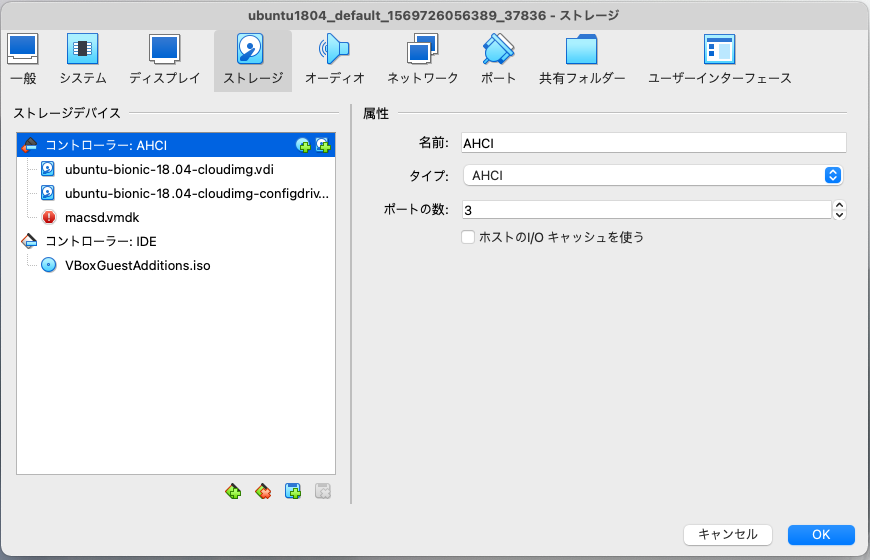

# MacのSDXCカードスロットをVirtualBoxから使用する

## 1. 各SD-Cardに対応するvmdkファイルを作成する

```bash
$ VBoxManage list hostdrives
Drive:       /dev/disk2
Model:       "Apple SDXC Reader"
Further disk and partitioning information is not available for drive "/dev/disk2". (E_ACCESSDENIED)

$ diskutil list
/dev/disk2 (internal, physical):
   #:                       TYPE NAME                    SIZE       IDENTIFIER
   0:     FDisk_partition_scheme                        *31.3 GB    disk2
   1:             Windows_FAT_32 NO NAME                 67.1 MB    disk2s1
   2:                      Linux                         503.3 MB   disk2s2
   3:                      Linux                         502.3 MB   disk2s3
                    (free space)                         30.2 GB    -

$ diskutil unmountDisk /dev/disk2
Unmount of all volumes on disk2 was successful

$ VBoxManage createmedium disk --filename macsd.vmdk --size=31300 --format VMDK --variant RawDisk --property RawDrive=/dev/disk2
0%...VBOX_E_FILE_ERROR
VBoxManage: error: Failed to create medium
VBoxManage: error: Could not create the medium storage unit '/Users/dspace/macsd.vmdk'.
VBoxManage: error: VMDK: Image path: '/Users/dspace/macsd.vmdk'. Failed to open the raw drive '/dev/disk2' for reading (VERR_ACCESS_DENIED) (VERR_ACCESS_DENIED).
VBoxManage: error: VMDK: could not create raw descriptor for '/Users/dspace/macsd.vmdk' (VERR_ACCESS_DENIED)
VBoxManage: error: Details: code VBOX_E_FILE_ERROR (0x80bb0004), component MediumWrap, interface IMedium
VBoxManage: error: Context: "RTEXITCODE handleCreateMedium(HandlerArg *)" at line 630 of file VBoxManageDisk.cpp
$ ls -l /dev/disk2
brw-r----- 1 root operator 1, 11  9 11 09:23 /dev/disk2

$ sudo VBoxManage createmedium disk --filename macsd.vmdk --size=31300 --format VMDK --variant RawDisk --property RawDrive=/dev/disk2
Password:
0%...10%...20%...30%...40%...50%...60%...70%...80%...90%...100%
Medium created. UUID: 8846645c-89cf-4571-b8d1-c2a103b62791
$ ls -l macsd.vmdk
-rw------- 1 root staff 538  9 11 09:28 macsd.vmdk

$ sudo chmod 777 /dev/disk2
Password:
$ sudo chmod 777 macsd.vmdk
$ ls -l /dev/disk2
brwxrwxrwx 1 root operator 1, 11  9 11 09:23 /dev/disk2
$ ls -l macsd.vmdk
-rwxrwxrwx 1 root staff 538  9 11 09:28 macsd.vmdk
$ mv macsd.vmdk <VirtutualBox_DIR>
```

## 2. VirtualBoxのストレージに追加する




## 3. Linux（VirtualBoxスレーブ）で使用する

```bash
$ lsblk
NAME   MAJ:MIN RM   SIZE RO TYPE MOUNTPOINTS
..
sda      8:0    0   100G  0 disk
└─sda1   8:1    0   100G  0 part /var/snap/firefox/common/host-hunspell
                                 /
sdb      8:16   0    10M  0 disk
sdc      8:32   0  30.6G  0 disk        // これがSD-Card
├─sdc1   8:33   0    64M  0 part
├─sdc2   8:34   0   480M  0 part
└─sdc3   8:35   0   479M  0 part
$ sudo blkid                            // このSD-Cardはpartion2, 3が未フォーマットだった
...
/dev/sdc1: UUID="632B-8F40" BLOCK_SIZE="512" TYPE="vfat" PARTUUID="fcbad681-01"
/dev/sdc2: PARTUUID="fcbad681-02"
$ sudo mount -t ext4 /dev/sdc2 /mnt
mount: /mnt: wrong fs type, bad option, bad superblock on /dev/sdc2, missing codepage or helper program, or other error.
$ sudo mount -t msdos /dev/sdc1 /mnt
$ ls /mnt
armstu~1.bin  _confi~1.txt  fixup4cd.dat  fseven~1      makefile      start.elf
armstub8.s    config~1.org  fixup4.dat    kernel~1.org  start4cd.elf
bootcode.bin  config.txt    fixup_cd.dat  kernel8.img   start4.elf
_confi~1.org  copyin~1.lin  fixup.dat     licenc~1.bro  start_cd.elf
$ sudo umount /mnt
$ ls /mnt

# 別のsdcardに交換

$ sudo blkid            // 変わっていない
...
/dev/sdc1: UUID="632B-8F40" BLOCK_SIZE="512" TYPE="vfat" PARTUUID="fcbad681-01"
/dev/sdc2: PARTUUID="fcbad681-02"
```

## 注意すること

- SD-Cardごとにvmdkファイルを作成する必要がある
- vagrant haltするまでSD-Cardは外さない
- vagrant upする際にはSD-Cardを挿入し、Mac側ではunmountする
- SD-Cardを使わないときはVirtualBoxのストレージ設定画面でvmdkを削除しておく（ホットプラグ可能にしてもダメ）

## 参考サイト

- [Mount SD card in VirtualBox from Mac OS X Host](https://www.geekytidbits.com/mount-sd-card-virtualbox-from-mac-osx/)
- [VirtualBox上のUbuntuにSDカードを認識させる](https://blog.sato0123.com/2015/03/01/SD_for_Ubuntu/)
- [Raw disk access用のvmdkファイル作成方法](https://datyotosanpo.blog.fc2.com/blog-entry-244.html)
