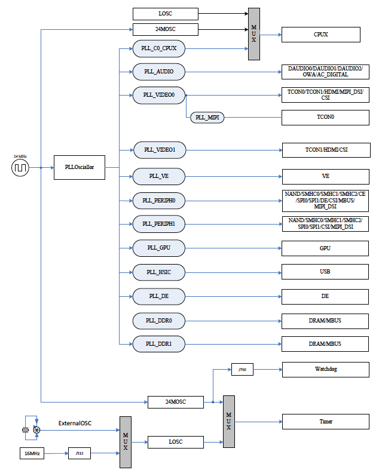

# 3.3 CCU

## 3.3.1 概要

CCUは、PLLの構成とクロックの生成、分周、分配、同期、ゲーティングの大部分を
制御します。CCUの入力信号には基準周波数（24MHz）となる外部クロックが含まれます。
CCUからの出力はほとんどがシステム内の他のブロックへのクロックです。

CCUには次の機能があります。

- 13個のPLLとCPUX用に独立したPLL
- バスソースと分周
- PLLのバイアス制御
- PLLのチューニング制御
- PLLのパターン制御
- モジュールクロックの構成
- バスクロックのゲーティング
- バスのソフトウェアリセット

## 3.3.2 機能説明

### 3.2.2.1 システムバスツリー

### 3.2.2.2 バスクロックツリー

### 3.2.2.3 モジュールクロックツリー

## 3.3.4 レジスタリスト

### ベースアドレス

| モジュール名 | 基底アドレス |
|:-------------|:-------------|
| CCU          | 0x01C20000   |

### レジスタ

| レジスタ名 | オフセット | 説明 |
|:-----------|:-----------|:-----|
| PLL_CPUX_CTRL_REG | 0x0000 | PLL_CPUX Control Register |
| PLL_AUDIO_CTRL_REG | 0x0008 | PLL_AUDIO Control Register |
| PLL_VIDEO0_CTRL_REG | 0x0010 | PLL_VIDEO0 Control Register |
| PLL_VE_CTRL_REG | 0x0018 | PLL_VE Control Register |
| PLL_DDR0_CTRL_REG | 0x0020 | PLL_DDR0 Control Register |
| PLL_PERIPH0_CTRL_REG | 0x0028 | PLL_PERIPH0 Control Register |
| PLL_PERIPH1_CTRL_REG | 0x002C | PLL_PERIPH1 Control Register |
| PLL_VIDEO1_CTRL_REG | 0x0030 | PLL_VIDEO1 Control Register |
| PLL_GPU_CTRL_REG | 0x0038 | PLL_GPU Control Register |
| PLL_MIPI_CTRL_REG | 0x0040 | PLL_MIPI Control Register |
| PLL_HSIC_CTRL_REG | 0x0044 | PLL_HSIC Control Register |
| PLL_DE_CTRL_REG | 0x0048 | PLL_DE Control Register |
| PLL_DDR1_CTRL_REG | 0x004C | PLL_DDR1 Control Register |
| CPU_AXI_CFG_REG | 0x0050 | CPUX/AXI Configuration Register |
| AHB1_APB1_CFG_REG | 0x0054 | AHB1/APB1 Configuration Register |
| APB2 _CFG_REG | 0x0058 | APB2 Configuration Register |
| AHB2_CFG_REG | 0x005C | AHB2 Configuration Register |
| BUS_CLK_GATING_REG0 | 0x0060 | Bus Clock Gating Register 0 |
| BUS_CLK_GATING_REG1 | 0x0064 | Bus Clock Gating Register 1 |
| BUS_CLK_GATING_REG2 | 0x0068 | Bus Clock Gating Register 2 |
| BUS_CLK_GATING_REG3 | 0x006C | Bus Clock Gating Register 3 |
| BUS_CLK_GATING_REG4 | 0x0070 | Bus Clock Gating Register 4 |
| THS_CLK_REG | 0x0074 | THS Clock Register |
| NAND_CLK_REG | 0x0080 | NAND Clock Register |
| SDMMC0_CLK_REG | 0x0088 | SDMMC0 Clock Register |
| SDMMC1_CLK_REG | 0x008C | SDMMC1 Clock Register |
| SDMMC2_CLK_REG | 0x0090 | SDMMC2 Clock Register |
| TS_CLK_REG | 0x0098 | TS Clock Register |
| CE_CLK_REG | 0x009C | CE Clock Register |
| SPI0_CLK_REG | 0x00A0 | SPI0 Clock Register |
| SPI1_CLK_REG | 0x00A4 | SPI1 Clock Register |
| I2S/PCM-0_CLK_REG | 0x00B0 | I2S/PCM-0 Clock Register |
| I2S/PCM-1_CLK_REG | 0x00B4 | I2S/PCM-1 Clock Register |
| I2S/PCM-2_CLK_REG | 0x00B8 | I2S/PCM-2 Clock Register |
| SPDIF_CLK_REG | 0x00C0 | SPDIF Clock Register |
| USBPHY_CFG_REG | 0x00CC | USBPHY Configuration Register |
| DRAM_CFG_REG | 0x00F4 | DRAM Configuration Register |
| PLL_DDR_CFG_REG | 0x00F8 | PLL_DDR Configuration Register |
| MBUS_RST_REG | 0x00FC | MBUS Reset Register |
| DRAM_CLK_GATING_REG | 0x0100 | DRAM Clock Gating Register |
| DE_CLK_REG | 0x0104 | DE Clock Register |
| TCON0_CLK_REG | 0x0118 | TCON0 Clock Register |
| TCON1_CLK_REG | 0x011C | TCON1 Clock Register |
| DEINTERLACE_CLK_REG | 0x0124 | DEINTERLACE Clock Register |
| CSI_MISC_CLK_REG | 0x0130 | CSI_MISC Clock Register |
| CSI_CLK_REG | 0x0134 | CSI Clock Register |
| VE_CLK_REG | 0x013C | VE Clock Register |
| AC_DIG_CLK_REG | 0x0140 | AC Digital Clock Register |
| AVS_CLK_REG | 0x0144 | AVS Clock Register |
| HDMI_CLK_REG | 0x0150 | HDMI Clock Register |
| HDMI_SLOW_CLK_REG | 0x0154 | HDMI Slow Clock Register |
| MBUS_CLK_REG | 0x015C | MBUS Clock Register |
| MIPI_DSI_CLK_REG | 0x0168 | MIPI_DSI Clock Register |
| GPU_CLK_REG | 0x01A0 | GPU Clock Register |
| PLL_STABLE_TIME_REG0 | 0x0200 | PLL Stable Time Register0 |
| PLL_STABLE_TIME_REG1 | 0x0204 | PLL Stable Time Register1 |
| PLL_PERIPH1_BIAS_REG | 0x021C | PLL_PERIPH1 Bias Register |
| PLL_CPUX_BIAS_REG | 0x0220 | PLL_CPUX Bias Register |
| PLL_AUDIO_BIAS_REG | 0x0224 | PLL_AUDIO Bias Register |
| PLL_VIDEO0_BIAS_REG | 0x0228 | PLL_VIDEO0 Bias Register |
| PLL_VE_BIAS_REG | 0x022C | PLL_VE Bias Register |
| PLL_DDR0_BIAS_REG | 0x0230 | PLL_DDR0 Bias Register |
| PLL_PERIPH0_BIAS_REG | 0x0234 | PLL_PERIPH0 Bias Register |
| PLL_VIDEO1_BIAS_REG | 0x0238 | PLL_VIDEO1 Bias Register |
| PLL_GPU_BIAS_REG | 0x023C | PLL_GPU Bias Register |
| PLL_MIPI_BIAS_REG | 0x0240 | PLL_MIPI Bias Register |
| PLL_HSIC_BIAS_REG | 0x0244 | PLL_HSIC Bias Register |
| PLL_DE_BIAS_REG | 0x0248 | PLL_DE Bias Register |
| PLL_DDR1_BIAS_REG | 0x024C | PLL_DDR1 Bias Register |
| PLL_CPUX_TUN_REG | 0x0250 | PLL_CPUX Tuning Register |
| PLL_DDR0_TUN_REG | 0x0260 | PLL_DDR0 Tuning Register |
| PLL_MIPI_TUN_REG | 0x0270 | PLL_MIPI Tuning Register |
| PLL_PERIPH1_PAT_CTRL_REG | 0x027C | PLL_PERIPH1 Pattern Control Register |
| PLL_CPUX_PAT_CTRL_REG | 0x0280 | PLL_CPUX Pattern Control Register |
| PLL_AUDIO_PAT_CTRL_REG | 0x0284 | PLL_AUDIO Pattern Control Register |
| PLL_VIDEO0_PAT_CTRL_REG | 0x0288 | PLL_VIDEO0 Pattern Control Register |
| PLL_VE_PAT_CTRL_REG | 0x028C | PLL_VE Pattern Control Register |
| PLL_DDR0_PAT_CTRL_REG | 0x0290 | PLL_DDR0 Pattern Control Register |
| PLL_VIDEO1_PAT_CTRL_REG | 0x0298 | PLL_VIDEO1 Pattern Control Register |
| PLL_GPU_PAT_CTRL_REG | 0x029C | PLL_GPU Pattern Control Register |
| PLL_MIPI_PAT_CTRL_REG | 0x02A0 | PLL_MIPI Pattern Control Register |
| PLL_HSIC_PAT_CTRL_REG | 0x02A4 | PLL_HSIC Pattern Control Register |
| PLL_DE_PAT_CTRL_REG | 0x02A8 | PLL_DE Pattern Control Register |
| PLL_DDR1_PAT_CTRL_REG0 | 0x02AC | PLL_DDR1 Pattern Control Register0 |
| PLL_DDR1_PAT_CTRL_REG1 | 0x02B0 | PLL_DDR1 Pattern Control Register1 |
| BUS_SOFT_RST_REG0 | 0x02C0 | Bus Software Reset Register 0 |
| BUS_SOFT_RST_REG1 | 0x02C4 | Bus Software Reset Register 1 |
| BUS_SOFT_RST_REG2 | 0x02C8 | Bus Software Reset Register 2 |
| BUS_SOFT_RST_REG3 | 0x02D0 | Bus Software Reset Register 3 |
| BUS_SOFT_RST_REG4 | 0x02D8 | Bus Software Reset Register 4 |
| CCM_SEC_SWITCH_REG | 0x02F0 | CCM Security Switch Register |
| PS_CTRL_REG | 0x0300 | PS Control Register |
| PS_CNT_REG | 0x0304 | PS Counter Register |
| PLL_LOCK_CTRL_REG | 0x0320 | PLL Lock Control Register |

## 3.3.6 プログラムガイドライン

### 3.3.6.1 PLL

1. 実際のアプリケーションではPLL_CPUXとPLL_DDR1以外のPLLは動的周波数スケーリングに
   対応していません。
2. PLL_DDR0の周波数を変更したら、PLL_DDR0コントロールレジスタの20ビットに`1`を書
   き込んで変更を有効にする必要があります。
3. PLL_DDR1の周波数を変更したら、PLL_DDR1コントロールレジスタの30ビットに`1`を書
   き込んで変更を有効にする必要があります。
4. PLL_MIPIを設定する場合、まず、LDO1とLDO2をイネーブルにし、100us遅延させ、
   分周係数を設定した後、イネーブルにして500us遅延させるとPLL_MIPIが出力として
   使用できるようになります。

### 3.3.6.2 バス

1. バスクロックを設定する場合、まず分周係数を設定し、分周比が利用可能になった後に
   クロックソースを切り替える必要があります。クロックソースの切り替えは少なくとも
   3クロックサイクル後に可能になります。
2. ほとんどのアプリケーションではバスクロックを動的に変更すべきではありません。

### 3.3.6.3 クロックの切り替え

クロックソースを切り替える前にクロックソース出力が有効であることを確認し、適切な
分周比を設定し、分周比が有効になってからクロックソースを切り替ええてください。

### 3.3.6.4 ゲーティングとリセット

モジュールクロックのゲーティングが解除される前にリセット信号が解除されていることを
確認してください。
