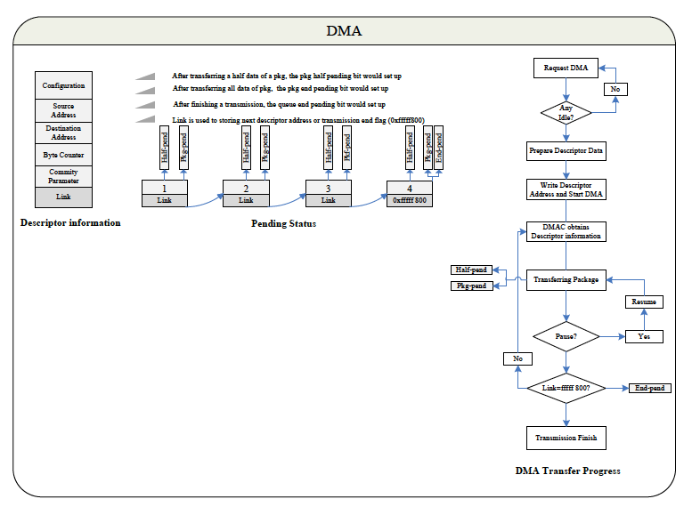

# 3.11 DMA

## 3.11.1 概要

チップには8つのDMAチャネルがあります。各DMAチャネルは割り込みを生成する
ことができます。保留状態に応じて、参照するDMAチャネルが対応する割り込みを
発生させます。また、各DMAチャネルの構成情報はDDR/SRAMに保存されます。
DMA転送を開始するとき、DMAChannel Descriptor Addressレジスタには
DMA転送に関連する構成情報を保持するDDR/SRAMのアドレス情報が格納されます。

## 3.11.2 機能の説明

### 3.11.2.1 ブロック図

### 3.11.2.2 DRQタイプと対応関係

表3-1: DMA DRQテーブル

**左側**: 送信元DRQタイプ、**右側**: 送信先DRQタイプ

| ポート番号 | モジュール名 | ポート名 | モジュルール名 |
|:-----------|:-------------|:---------|:---------------|
| Port 0 | SRAM | Port 0 | SRAM |
| Port 1 | SDRAM | Port 1 | SDRAM |
| Port 2  | / | Port 2 | OWA_TX |
| Port 3 | I2S/PCM_0_RX | Port 3 | I2S/PCM_0_TX |
| Port 4 | I2S/PCM_1_RX | Port 4 | I2S/PCM_1_TX |
| Port 5 | NAND | Port 5 | NAND |
| Port 6 | UART0_RX | Port 6 | UART0_TX |
| Port 7 | UART1_RX | Port 7 | UART1_TX |
| Port 8 | UART2_RX | Port 8 | UART2_TX |
| Port 9 | UART3_RX | Port 9 | UART3_TX |
| Port 10 | UART4_RX | Port 10 | UART4_TX |
| Port 11 | / | Port 11 | / |
| Port 12 | / | Port 12 | / |
| Port 13 | / | Port 13 | / |
| Port 14 | / | Port 14 | / |
| Port 15 | Audio Codec | Port 15 | Audio Codec |
| Port 16 | / | Port 16 | / |
| Port 17 | USB OTG_EP1 | Port 17 | USB OTG_EP1 |
| Port 18 | USB OTG_EP2 | Port 18 | USB OTG_EP2 |
| Port 19 | USB OTG_EP3 | Port 19 | USB OTG_EP3 |
| Port20 | USB OTG_EP4 | Port 20 | USB OTG_EP4 |
| Port 21 | USB OTG_EP5 | Port 21 | USB OTG_EP5 |
| Port 22 | / | Port 22 | / |
| Port 23 | SPI0_RX | Port 23 | SPI0_TX |
| Port 24 | SPI1_RX | Port 24 | SPI1_TX |
| Port 25 | / | Port 25 | / |
| Port 26 | / | Port 26 | / |
| Port 27 | / | Port 27 | I2S/PCM_2_TX |
| Port 28 | / | Port 28 | / |
| Port 29 | / | Port 29 | /|
| Port 30 | / | Port 30 | / |

### 3.11.2.3 DMAの説明

このセクションではDMAディスクリプタレジスタについて詳しく紹介します。

DMA転送を開始する際、モジュールデータはリンクデータ情報を持つ
パッケージとして転送されます。DMA Statusレジスタを読み出すことで
DMAチャネルのステータスを知ることができます。DMA Channel Descriptor
Addressレジスタを読み戻すとその値は転送中のパッケージのリンクデータに
なります。値が0x1ffff800に等しい場合のみNULLとみなすことができ、その
パッケージはこのDMA転送の最後のパッケージであることを意味します。
それ以外の場合、この値は次のパッケージの開始アドレスを意味します。
DMA Channel Descriptor Addressレジスタはパッケージ転送中に変更される
場合があります。

パッケージの半分を転送すると関連する保留ビットが自動的にセットされ、
対応する割り込みが有効になっている場合はDMAはシステムに割り込みを
かけます。同様のことがパッケージが完全に転送された際にも起こります。
一方、DMAがデータ内の最後のパッケージを転送した場合、該当する保留
ビットがセットされ、対応する割り込みが有効になっていれば割り込みを
発生します。このフロープロセスはブロック図のセクションに示されています。

DMAの転送中に構成情報をDMA Channel Configurationレジスタにより取得
することができます。DDRまたはSRAMの構成レジスタのアドレスの背後には
DMA転送の他の情報を含むいくつかのレジスタがあります。その構成図も
ブロック図のセクションに示されています。また、DMA Channel Currnt Source
AddresレジスタやDMA Channel Current Destination Addressレジスタ、DMA
Chennele Byte Counter Leftレジスタを読むことで転送データに関する
その他の情報を得ることができます。構成情報はワードアラインである
必要があります。

関連する一時停止レジスタを設定していると緊急事態が発生すると
転送データは一時停止されます。一時停止データは一時停止レジスタの
同じビットに0をセットすると推定することができます。

## 3.11.3　DMAレジスタリスト

### 基底アドレス

| モジュール名 | 基底アドレス |
|:-------------|:---------------|
| DMA | 0x01C02000 |

### レジスタ

| レジスタ名 | オフセット | 記述 |
|:-----------|:-----------|:-----|
| DMA_IRQ_EN_REG | 0x00 | DMA IRQ Enable Register |
| DMA_IRQ_PEND_REG | 0x10 | DMA IRQ Pending Register |
| DMA_SEC_REG | 0x20 | DMA Security Register |
| DMA_AUTO_GATE_REG | 0x28 | DMA Auto Gating Register |
| DMA_STA_REG | 0x30 | DMA Status Register |
| DMA_EN_REG | 0x100+N*0x40 | DMA Channel Enable Register (N=0~7) |
| DMA_PAU_REG | 0x100+N*0x40+0x4 | DMA Channel Pause Register (N=0~7) |
| DMA_DESC_ADDR_REG | 0x100+N*0x40+0x8 | DMA Channel Start Address Register (N=0~7) |
| DMA_CFG_REG | 0x100+N*0x40+0xC | DMA Channel Configuration Register (N=0~7) |
| DMA_CUR_SRC_REG | 0x100+N*0x40+0x10 | DMA Channel Current Source Register (N=0~7) |
| DMA_CUR_DEST_REG | 0x100+N*0x40+0x14 | DMA Channel Current Destination Register (N=0~7) |
| DMA_BCNT_LEFT_REG | 0x100+N*0x40+0x18 | DMA Channel Byte Counter Left Register (N=0~7) |
| DMA_PARA_REG | 0x100+N*0x40+0x1C | DMA Channel Parameter Register (N=0~7) |
| DMA_MODE_REG | 0x100+N*0x40+0x28 | DMA Mode Register (N=0~7) |
| DMA_FDESC_ADDR_REG | 0x100+N*0x40+0x2C | DMA Formar Descriptor Address Register (N=0~7) |
| DMA_PKG_NUM_REG | 0x100+N*0x40+0x30 | DMA Package Number Register (N=0~7) |
