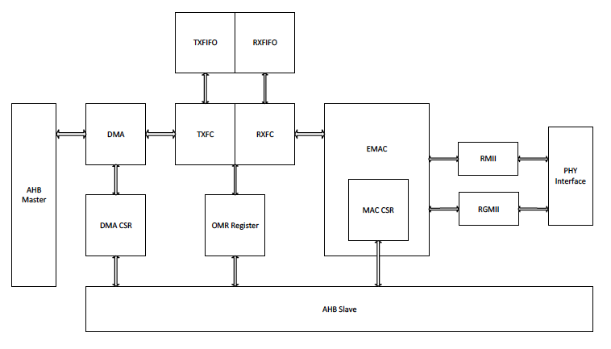
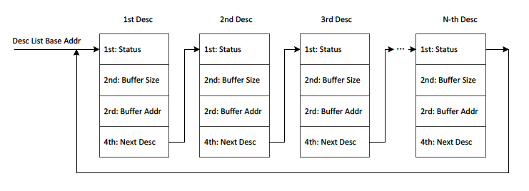

# EMAC

## 7.9.1 概要

Ethernet MAC(EMAC)コントローラはホストがIEEE 802.3-2002規格に準拠した
Ethernet上のデータ送受信をできるようにします。RMII/RGMIIインタフェースに
よる10M/100M/1000M外部PHYを全二重/半二重モードでサポートします。
Ethernet MAC-DMAはディスクリプタの連結リストに基づくパケット指向の
データ転送用に設計されています。4KバイトのTXFIFOと16KバイトのRXFIFOの
提供により連続的な送受信が維持されます。このモジュールはフロー制御、
CRCの付与と削除、アドレスフィルタリングもサポートしています。

Ethernet MACコントローラには以下の機能があります.

- 10/100/1000Mbpsデータ転送レートをサポート
- RMII/RGMII PHYインタフェースをサポート
- 全二重と半二重の動作をサポート
- プログラム可能なフレーム長により最大16KBの標準またはジャンボ
  Ethernetフレームをサポート
- さまざまな柔軟なアドレスフィルタリングモードをサポート
- 送信パケットと受信パケットに個別の32ビットステータスを返す
- フレームデリミタによるパケット指向のDMA転送の最適化
- 連結リストによるディスクリプタのチェイニングをサポート
- 最小限のCPUの介入による大きなデータブロックの転送を可能にする
  ディスクリプタアーキテクチャ。各ディスクリプタは最大4KBのデータ
  転送が可能
- 正常動作と転送エラーのための包括的なステータスレポート
- 送信パケット用の4KBのTXFIFOと受信パケット用の16KBのRXFIFO
- さまざまな動作条件用のプログラム可能な割り込みオプション

## 7.9.2 ブロック図

EMACコントローラのブロック図を以下にしまします。

## 7.93 EMACコアレジスタリスト

### 基底アドレス

| モジュール名 | 基底アドレス |
|:-------------|:---------------|
| EMAC | 0x01C30000 |

### レジスタ

| レジスタ名 | オフセット | 記述 |
|:-----------|:-----------|:-----|
| BASIC_CTL_0 | 0x00 | Basic Control 0 Register |
| BASIC_CTL_1 | 0x04 | Basic Control 1 Register |
| INT_STA | 0x08 | Interrupt Status Register |
| INT_EN | 0x0C | Interrupt Enable Register |
| TX_CTL_0 | 0x10 | Transmit Control 0 Register |
| TX_CTL_1 | 0x14 | Transmit Control 1 Register |
| TX_FLOW_CTL | 0x1C | Transmit Flow Control Register |
| TX_DMA_DESC_LIST | 0x20 | Transmit Descriptor List Address Register |
| RX_CTL_0 | 0x24 | Receive Control 0 Register |
| RX_CTL_1 | 0x28 | Receive Control 1 Register |
| RX_DMA_DESC_LIST | 0x34 | Receive Descriptor List Address Register |
| RX_FRM_FLT | 0x38 | Receive Frame Filter Register |
| RX_HASH_0 | 0x40 | Hash Table 0 Register |
| RX_HASH_1 | 0x44 | Hash Table 1 Register |
| MII_CMD | 0x48 | Management Interface Command Register |
| MII_DATA | 0x4c | Management Interface Data Register |
| ADDR_HIGH_0 | 0x50 | MAC Address High Register 0 |
| ADDR_LOW_0 | 0x55 | MAC Address High Register 0 |
| ADDR_HIGH_x | 0x50+8*x | MAC Address High Register x(x:1~7) |
| ADDR_LOW_x | 0x54+8*x | MAC Address Low Register x(x:1~7) |
| TX_DMA_STA | 0xB0 | Transmit DMA Status Register |
| TX_CUR_DESC | 0xB4 | Current Transmit Descriptor Register |
| TX_CUR_BUF | 0xB8 | Current Transmit Buffer Address Register |
| RX_DMA_STA | 0xC0 | Receive DMA Status Register |
| RX_CUR_DESC | 0xC4 | Current Receive Descriptor Register |
| RX_CUR_BUF | 0xC8 | Current Receive Buffer Address Register |
| RGMII_STA | 0xD0 | RGMII Status Register |

## 7.9.5 EMAC RX/TXディスクリプタ

EMACの内部DMAはホストメモリと内部RX/TX FIFO間のデータ転送を
ディスクリプタの連結リストで行います。各ディスクリプタは4ワードで
構成されており、TXフレームとRXフレームの転送に必要な情報を含んで
います。ディスクリプタリストの構造を図7-20に示します。各ディスクリプタの
アドレスは32ビットアライメントでなければなりません。

### 7.9.5.1 送信ディスクリプタ

#### 送信ディスクリプタの第1ワード

| ビット | フィールド名 | 説明 |
|:-------|:-------------|:-----|
| 31 | TX_DESC_CTL | 1: カレントディスクリプタはDMAで使用できる。このビットは全フレームが送信されるか、カレントディスクリプタのバッファの全データが送信されるとDMAによってクリアされる |
| 16 | TX_HEADER_ERR | 1: 送信フレームのヘッダーのチェックサムに誤りがある |
| 14 | TX_LENGTH_ERR | 1: 送信フレーム長が誤りがある |
| 12 | TX_PAYLOAD_ERR | 1: 送信フレームのペイロードのチェックサムに誤りがある |
| 10 | TX_CRC_ERR | 1: 送信中にキャリアが消失 |
| 9 | TX_COL_ERR_0 | 1: コンテンション期間後に衝突がありフレームがアボート |
| 8 | TX_COL_ERR_1 | 1: 衝突回数過多でフレームがアボート |
| 6:3 | TX_COL_CNT | 送信中の衝突回数 |
| 2 | TX_DEFER_ERR | 1: 遅延過多のためフレームがアボート |
| 1 | TX_UNDERFLOW_ERR | 1: TX FIFOのアンダーフローエラーのためフレームがアボート |
| 0 | TX_DEFER | 1: 半二重モードの場合、EMACがフレーム送信を遅延させる |

#### 送信ディスクリプタの第2ワード

| ビット | フィールド名 | 説明 |
|:-------|:-------------|:-----|
| 31 | TX_INT_CTL | 1: カレントフレームが送信された場合、割り込みステータスレジスタのTX_INTがセットされる |
| 30 | LAST_DESC | 1: カレントディスクリプタはカレントフレームの最後のディスクリプタ |
| 29 | FIR_DESC | 1: カレントディスクリプタはカレントフレームの最初のディスクリプタ |
| 28:27 | CHECKSUM_CTL | 送信フレームにチェックサムを挿入するかを制御する |
| 26 | CRC_Ctl | 1: CRCフィールドは送信されない |
| 10:0 | BUF_SIZE | カレントディスクリプタで指定されているバッファのサイズ |

#### 送信ディスクリプタの第3ワード

| ビット | フィールド名 | 説明 |
|:-------|:-------------|:-----|
| 31:0 | BUF_ADDR | カレントディスクリプタで指定されているバッファのアドレス |

#### 送信ディスクリプタの第4ワード

| ビット | フィールド名 | 説明 |
|:-------|:-------------|:-----|
| 31:0 | NEXT_DESC_ADDR | 次のディスクリプタのアドレス。32ビットアラインであること |

### 7.9.5.2 受信ディスクリプタ

#### 受信ディスクリプタの第1ワード

| ビット | フィールド名 | 説明 |
|:-------|:-------------|:-----|
| 31 | RX_DESC_CTL | 1: カレントディスクリプタはDMAで使用できる。このビットは完了フレームが受信されるか、カレントディスクリプタのバッファが満杯になるとDMAによってクリアされる |
| 30 | RX_DAF_FAIL | 1: カレントフレームはDAフィルタを渡さない |
| 29:16 | RX__FRM_LEN | LAST_DESCがセットされておらず、エラービットもセットされていない場合はカレントフレームで受信したデータの長さ 
LAST_DESCがセットされており、RX_OVERFLOW_ERRとRX_NO_ENOUGH_BUF_ERRがセットされていない場合は受信フレームの長さ |
| 14 | RX_NO_ENOUGH_BUF_ERR | 1: バッファ不足でカレントフレームがクリップされた |
| 13 | RX_SAF_FAIL | 1: カレントフレームはSAフィルタを渡さない |
| 11 | RX_OVERFLOW_ERR | 1: バッファオーバーフローエラーが発生した。カレントフレームには誤りがある |
| 9 | FIR_DESC | 1: カレントディスクリプタはカレントフレームの最初のディスクリプタ |
| 8 | LAST_DESC | 1: カレントディスクリプタはカレントフレームの最後のディスクリプタ |
| 7 | RX_HEADER_ERR | 1: フレームヘッダーのチェックサムに誤りがある |
| 6 | RX_COL_ERR | 1: 半二重モードで受信中に遅延衝突があった |
| 4 | RX_LENGTH_ERR | 1: カレントフレーム長が誤りがある |
| 3 | RX_PHY_ERR | 1: 受信中にPHYから受信エラー信号がアサートされた |
| 1 | RX_CRC_ERR | 1: 受信フレームのCRCフィールドに誤りがある |
| 0 | RX_PAYLOAD_ERR | 1: 受信フレームのペイロードのチェックサムまたは長さに誤りがある |

#### 受信ディスクリプタの第2ワード

| ビット | フィールド名 | 説明 |
|:-------|:-------------|:-----|
| 31 | RX_INT_CTL | 1: フレームが受信された場合、RX_INTはセットされない |
| 10:0 | BUF_SIZE | カレントディスクリプタで指定されているバッファのサイズ |

#### 受信ディスクリプタの第3ワード

| ビット | フィールド名 | 説明 |
|:-------|:-------------|:-----|
| 31:0 | BUF_ADDR | カレントディスクリプタで指定されているバッファのアドレス |

#### 受信ディスクリプタの第4ワード

| ビット | フィールド名 | 説明 |
|:-------|:-------------|:-----|
| 31:0 | NEXT_DESC_ADDR | 次のディスクリプタのアドレス。32ビットアラインであること |
