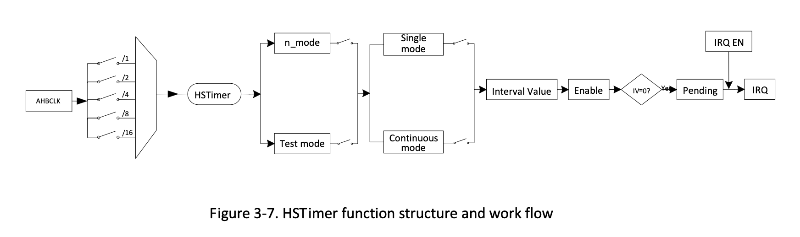

# ハイスピードタイマー

## 3.9.1 概要

ハイスピードタイマーのクロックソースはAHBCLKに固定されており、これはOSC24Mよりはるかに高いため、
この種のタイマーはハイスピードタイマーと呼ばれます。他のタイマーと比較すると、ハイスピードタイマーは
はるかに正確に計算します。制御レジスタの関連ビットに1をセットするとhstimerはテストモードに入り、
これはシステムシミュレーションに使用されます。カレント値レジスタLOとHIにある現在値がゼロまで
カウントダウンされ、割り込み有効ビットをセットするとタイマーは割り込みを生成します。

ハイスピードタイマーには次の機能があります。

- 56ビットカウンタを備えたHSTimerが1つ
- HSTimerはペンディグを生成できる
- クロックソースはAHBクロックと同期しており、他のタイマーよりもはるかに正確に計算できる。
- システムシミュレーション用のテストモードをサポートする。

## 3.9.2 動作原理

### 3.9.2.1 HSTimerのクロックゲーティングとソフトウェアリセット

デフォルトでは、HSTimerのクロックゲーティングはマスクされています。HSTimerを使用する場合は
このクロックゲーティングを`Bus Clock Gating Register0`で開き、次に、CCUモジュール上の
`Bus Software Reset Register 0`でソフトウェアリセットをデアサートする必要があります。
HSTimerを使用する必要がない場合はゲーティングビットとソフトウェアリセットビットには共に0を
セットする必要があります。

### 3.9.2.2 HSTimerのリロードビット

タイマーのリロードとは異なり、インターバル値が`HS Timer Current Value Low`レジスタと
`HS Timer Current Value High`レジスタにリロードされた場合、`Reload`ビットは明示的に
クリアしないと自動的に0に切り替わることはありません。ソフトウェアが`HS Timer Current Value Low`
レジスタと`HS Timer Current Value High`レジスタを一時停止状態で新しいインターバル値から
ダウンカウントさせたい場合は`Reload`ビットと`Enable`ビットに同時に1を書き込む必要があります。

## 3.9.3 HSTimerのブロック図



HSTimerには2つの作業モードと2つのカウントモードがあります。n_modeは通常カウントに使用され、
テストモードはシステムシミュレーションで使用されます。各作業モードにはシングルモードと連続モードと
いう2つのカウントモードがあります。これら2つのカウントモードはタイマーと同じ原理を持ちます。すなわち、
現在値が0までカウントダウンした場合、シングルモードではHSTimerが無効になり、連続モードでは
HSTimerは無効にならず、インターバル値から再びカウントダワンされます。HSTimer 56ビットカウンタは
高位24ビットカウンタ（`HS Timer Current Value Hi Register`）と低位32ビットカウンタ
（`HS Timer Current Value Lo Register`）が結合して動作します。

## 3.9.4 HSTimerレジスタリスト

### 基底アドレス

| モジュール名 | 基底アドレス |
|:-------------|:---------------|
| ハイスピードタイマー | 0x01C60000 |


### レジスタ

| レジスタ名 | オフセット | 記述 |
|:-----------|:-----------|:-----|
| HS_TMR_IRQ_EN_REG | 0x00 | HS Timer IRQ Enable Register |
| HS_TMR_IRQ_STAS_REG | 0x04 | HS Timer Status Register |
| HS_TMR_CTRL_REG | 0x10 | HS Timer Control Register |
| HS_TMR_INTV_LO_REG | 0x14 | HS Timer Interval Value Low Register |
| HS_TMR_INTV_HI_REG | 0x18 | HS Timer Interval Value High Register |
| HS_TMR_CUR_LO_REG | 0x1C | HS Timer Current Value Low Register |
| HS_TMR_CUR_HI_REG | 0x20 | HS Timer Current Value High Register |

## 3.9.5 HSTimerレジスタ詳細

## 3.9.6 プログラミングガイドライン

HSTimerを使用して1usのディレイを例にすると、AHB1CLKを100MHzに構成し、n_mode、
Single mode、pre-scale 2を選択します。

```c
writel(0x0, HS_TMR_INTV_HI_REG);    // 高位インターバル値を Ox0 にセット
writel(0x32, HS_TMR_INTV_LO_REG);   // 低位インターバル値を 0x32 にセット
writel (0x90, HS_TMR_CTRL_REG);     // n_mode, 2 pre-scale, single modeを選択
writel(readl(HS_TMR_CTRL_REG) | (1<<1), HS_TMR_CTRL_REG);    // Reloadビットをセット
writel(readl(HS_TMR_CTRL_REG) | (1<<0), HS_TMR_CTRL_REG);    // HSTimerを有効化
while(!(readl(HS_TMR_IRQ_STAS_REG) & 1));   // HSTimerの発火を待つ
writel(1, HS_TMR_IRQ_STAS_REG);             // HSTimerの発火フラグをクリアする
```

**訳注**: 100MHz, プリスケール1で使用すると1tickは10nsになるが、A64にはなかった。