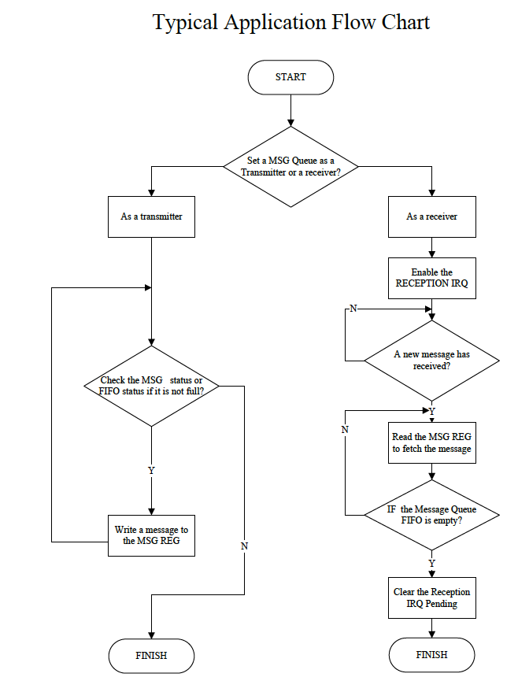

# 3.13 メッセージボックス

## 3.13.1 概要

メッセージボックスはオンチッププロセッサ間通信のためのメッセージ
ボック割り込み機構を提供します。一連のメッセージキューを通じて
あるプロセッサから別のプロセッサへメッセージを送信することと別の
プロセッサからメッセージを受信知ることが可能になります。各キューは
4つの32ビット深さのFIFOを持っています。メッセージボックレジスタを
構成することにより相互通信チャネルを確立することができ、メッセージ
ボックス割り込み機構の下で動作します。

メッセージボックスには次の機能があります。

- メッセージボックスインスタンスに2ユーザ（CPUS用のUser0とCPUX用のUser1）
- メッセージボックスインスタンスに8つのメッセージキュー
- 各キューは相互通信チャネル確立用に4つの32ビット深さのFIFOを持つ
- 各キューはユーザ用に送信または受信として構成可能
- メッセージ受信とqueue-not-fullを通知する割り込み機構

## 3.12.2 機能の説明

### 3.12.2.1 典型的な応用

### 3.12.2.2 機能ブロック図

メッセージボックスはプロセッサが他のプロセッサとの相互接続チャネルを
確立するためのレジスタセットをサポートしています。プロセッサは相互接続の
ためのメッセージキュー番号、自身と相互接続可能なプロセッサとの送信機
または受信機に使用されるキューを決定します。すべてのキューはプロセッサが
キューFIFOのフルステータスをチェックするためのMSGBox FIFO Status
レジスタ、プロセッサがキューFIFO内のメッセージ番号をチェックするための
MSGBox Message Statusレジスタを持っています。それ以外の場合、各キューは
割り込み要求に使用する対応するIRQスタータスビットとIRQイネーブルビットを
持っています。

## 3.13.3 動作原理

### 3.13.3.1 メッセージキューの割当

あるユーザから他のユーザへ任意のメッセージキューを通じてメッセージを
送信するにはMSGBox Control Register 0、または、MSGBox Control
Regsiter 1の対応するビットを設定します。

MSGBOX_MSG_REG_Mレジスタに32 ビットのメッセージが書き込まれると
そのメッセージがFIFOキューに追加されます。このキューは4つのメッセージを
保持します。キューが一杯になるとメッセージは破棄されます。受信側の
ユーザはMSGBox Message Queue m Register（mはメッセージキュー番号で
m=0 から 7）を読み込むと対応するメッセージキュー FIFOからメッセージを
取り出すことができます。

ユーザがメッセージを送信するにはレジスタポーリングを使用することが
推奨されます。

- メッセージキューを送信側に設定する（MSGBox Control Register 0、または
  MSGBox Control Register 1を使用）
- FIFOステータスまたはメッセージステータスをチェックする（MSGBox FIFO
  status Register m、またはMSGBox Message Status Register mを使用）
- 空きがあれば、対応するMSGBox Message Queue Registerにメッセージを
  書き込む

初期のMSGBox Statusがメッセージキューが満杯であることを示す場合には
送信割り込みが使用できます。この場合、送信側は対応するMSGBox IRQ Enable
Register u の割り込みをイネーブルにすることができます。これにより
メッセージキューが満杯でないことを割り込みで通知することができます。

### 3.13.3.2 割り込み要求

割り込み要求を使うことでMSGBoxのユーザは新しいメッセージを受信した
ときやメッセージキューが満杯でないときに通知を受けることができます。

イベントはMSGBox IRQ Enable Register u (u はユーザ番号でu=0, 1)
レジスタの対応するビットをイネーブルにすることで割り込み要求を生成
できます。イベントは適切なMSGBox IRQ Status Register u レジスタで
報告されます。

イベントはMSGBox IRQ Enable Register u レジスタの対応するビットを
ディセーブルにすることで割り込み要求の生成を停止します。

MSGBox IRQ Status Register u の場合、割り込み要求発生がこのイベントに
対して無効になっていてもイベントは対応するビットで報告されます。

## 3.13.4 メッセージボックスレジスタリスト

### ベースアドレス

| モジュール名 | 基底アドレス |
|:-------------|:---------------|
| MSGBOX | 0x01C17000 |

### レジスタ

| レジスタ名 | オフセット | 記述 |
|:-----------|:-----------|:-----|
| MSGBOX_CTRL_REG0 | 0x0000 | メッセージキュー属性制御レジスタ 0 |
| MSGBOX_CTRL_REG1 | 0x0004 | メッセージキュー属性制御レジスタ 1 |
| MSGBOXU_IRQ_EN_REG | 0x0040 + N*0x20 | ユーザN 用のIRQイネーブル (N=0, 1)|
| MSGBOXU_IRQ_STATUS_REG | 0x0050 + N*0x20 | ユーザN用のIRQステータス (N=0, 1) |
| MSGBOXM_FIFO_STATUS_REG | 0x0100 + N*0x4 | メッセージキューN用のFIFOステータス (N = 0~7) |
| MSGBOXM_MSG_STATUS_REG | 0x0140 + N*0x4 | メッセージキューN用のメッセージステータス (N=0~7) |
| MSGBOXM_MSG_REG | 0x0180 + N*0x4 | メッセージキューN用のメッセージレジスタ (N=0~7) |
