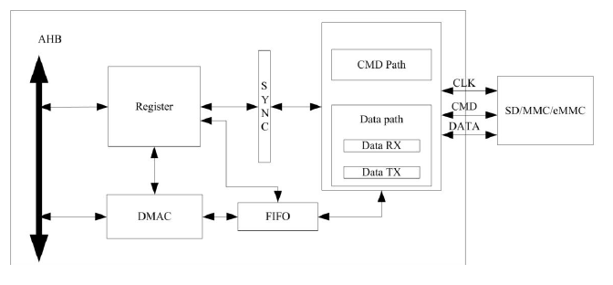
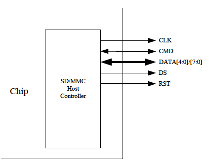
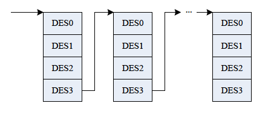

# 4.3 SD-MMCホストコントローラ

## 4.3.1 概要

SD-MMCホストコントローラ (SMHC)は、セキュアデジタルマルチメディア
カードコントローラとして構成でき、セキュアデジタルメモリ（SDメモリ）、
UHS-1カード、セキュアデジタルI/O（SDIO）、マルチメディアカード（MMC）、
eMMCを同時にサポートします。

SMHCコントローラは以下の機能を持っています。

- SD (Secure Digital)メモリプロトコルコマンド (SD3.0まで)
- SDIO (Secure Digital I/O)プロトコルコマンド (SDIO2.0まで)
- MMC (Multimedia Card)プロトコル コマンド (MMC5.0 まで)
- eMMCブート動作をサポート
- ホストプロセッサへのコマンド完了信号と割り込み機能とコマンド完了信号の無効化機能をサポート
- SD（バージョン1.0から3.0）またはMMC（バージョン3.3から5.0）を1つサポート
- ハードウェアによるCRCの生成とエラー検出をサポート
- ホストのプルアップ制御をサポート
- 1ビット/4ビットモードでのSDIO割り込みをサポート
- 1バイトから65535バイトのブロックサイズをサポート
- ディスクリプタベースの内部DMAコントローラをサポート
- データ転送用の1024バイトの内部FIFO
- 3.3V/1.8VのIOパッドをサポート

## 4.3.2 ブロック図

## 4.3.3 SMHCコントローラタイミング図

各種仕様書を参照

## 4.3.4 SMHC操作の説明

### 4.3.4.1 外部信号一覧

| ポート名 | 幅 | 方向 | 記述 |
|:---------|:--:|:-----|:-----|
| CLK | 1 | OUT | SD/SDIO/MMCカード用のクロック信号 |
| CMD | 1 | IN/OUT | CMDライン |
| DATA | 4/8 | IN/OUT | データライン. SMHC0とSMHC1は4ビット、SMHC2は8ビット |
| DS | 1 | OUT | SMHC2用のデータストローブ信号 |
| RST | 1 | OUT | SMHC2用のリセット信号 |

### 4.3.4.2 遅延チェーンの校正

サンプルクロックの遅延チェーンとデータストローブの遅延チェーン（SMHC2のみ）
はサンプルクロック/データストローブとデータ信号の間のタイミングを適切にする
ための遅延の生成に使用されます。各遅延チェーンは64個の遅延セルで構成され
ます。1つの遅延セルの遅延時間は遅延チェイン校正により推定することができます。

遅延チェーン校正の手順は以下の通りです。

**ステップ1**: SMHCを有効にする。SMHCのレジスタを操作して遅延チェインを
校正するには、Bus Software Reset Register 0 (US_SOFT_RST_REG0)とBus Clock
Gating Register 0 (BUS_CLK_GATING_REG0)を通してSMHCをイネーブルにする必要が
あります。

**ステップ2**: SMHCに適切なクロックを設定する。校正遅延チェーンはクロック
制御ユニット (CCU) のSMHC用クロックに基づいています。校正遅延チェーンは
SMHCの内部機能であり、デバイスは必要としません。したがって、デバイス用の
クロック信号をオープンする必要はありません。推奨クロック周波数は200MHzです。

**ステップ3**: 適切な初期遅延値を設定する。遅延制御レジスタ
(SMHC_SAMP_DL_REG) に0xA0を書き込んで遅延ソフトウェアイネーブル
(bit[7]) を有効にし、Delay chain(bit[5:0])に初期遅延値0x20を設定する。
そして、遅延制御レジスタに0x0を書き込んで値をクリアする。

**ステップ4**: 遅延制御レジスタに0x8000を書き込んで遅延チェーン校正を
開始する。

**ステップ5**: 校正完了フラグ（遅延制御レジスタのBit14）がセットされる
まで待つ。遅延セルの数は遅延制御レジスタのビット[8:13]で示される。これらの
遅延セルによって生成される遅延時間はほぼSMHCのクロック周期に等しい。
この値は校正結果である。

**ステップ6**: SMHCのクロック周期と校正結果に従って遅延セルの1つの遅延時間を
計算する。

**注意**: 上の説明において遅延制御レジスタにはSMHC Sample Delay Control
Register (SMHC_SMAP_DL)とSMHC Data Strobe Delay Register (SMHC_DS_DL)が
含まれます。遅延ソフトウェアイネーブルにはSample Delay Software Enableと
Data Strobe Delay Software Enableが含まれます。遅延チェーンにはSample Delay
SoftwareとData Strobe Delay Softwareが含まれます。

## 4.3.5 SMHC DMAコントローラの説明

SMHCコントローラはホストメモリとSDMMCポートの間でデータ転送を行うための
内部DMAコントローラ (IDMAC) を備えています。ディスクリプタを使用すると、
IDMACは次のDMA転送引数を自動的にロードすることによりCPUの介入を必要と
せずにソースからデスティネーションへ効率的にデータを移動することができます。
IDMACでデータを転送する前に、ホストドライバはディスクリプタリストを構築し、
すべてのDMA転送の引数を設定してから、ディスクリプタを起動し、DMAを開始する
必要があります。IDMACには割り込みコントローラがあり、有効にすると、データ
転送が完了した場合や何らかのエラーが発生した場合などにHOST CPUに割り込みを
かけることができます。

### 4.3.5.1 IDMACディスクリプタの構造

IDMACはチェーン構造を持つ記述子を使用します。各記述子は一意のバッファと
次のディスクリプタを指しています。

この図はディスクリプタの内部フォーマットを示しています。ディスクリプタ
アドレスは32ビットバスに使用されているバス幅にアラインされている必要が
あります。各ディスクリプタは16バイト（128ビット）の制御/ステータス情報を
持ちます。DSNnは各々、DES0は[31:0]ビット、DES1は[63:32]ビット、DES2は[95:64]
ビット、DES3は[127:96]ビットを意味します。

### 4.3.5.2 DES0の定義

| ビット | 名前 | 記述 |
|:-------|:-----|:---------------|
| 31 | HOLD | DES_OWN_FLAG ディスクリプタの所有者が 1: IDMAC, 0: ホスト 転送が終わるとクリアされる |
| 30 | ERROR | ERR_FLAG: 転送中にエラーが発生した場合にセットされる |
| 4 | チェーンフラグ | CHAIN_MOD 1: 2番めのアドレスは次のディスクリプタのアドレスである 1をセットする必要がある |
| 3 | 先頭DESフラグ | FIRST_FLAG 1: このディスクリプタはデータの最初のバッファを含む 最初のDESは1をセットする必要がある |
| 2 | 最終DESフラグ | LAST_FLAG 1: このディスクリプタが指しているバッファは最後のデータバッファである |
| 1 | 完了時割り込み無効 | CUR_TXRX_OVER_INT_DIS セットするとIDMACステータスレジスタのTX/RX割り込みビットがこのディスクリプタが指すバッファで終了するデータに対してセットされるのを防ぐ |

### 4.3.5.3 DES1の定義

| ビット | 名前 | 記述 |
|:-------|:-----|:---------------|
| 15:0 | バッファサイズ | BUFF_SIZE データバッファのバイト単位のサイズを示す。4の倍数でなければならない。0の場合、DMAはこのバッファを無視して次のディスクリプタに進む |

### 4.3.5.4 DES2の定義

| ビット | 名前 | 記述 |
|:-------|:-----|:---------------|
| 31:0 | バッファアドレスポインタ | BUFF_ADDR データバッファの物理アドレスを示す。IDMACはバス幅32に対応するDES2[1:0]を無視する（4バイトアライン） |

### 4.3.5.5 DES3の定義

| ビット | 名前 | 記述 |
|:-------|:-----|:---------------|
| 31:0 | 次のディスクリプタアドレス | NEXT_DESP_ADDR 次のディスクリプタが存在する物理アドレスを示す |

## 4.3.6 SMHCレジスタ一覧

### ベースアドレス

| モジュール名 | 基底アドレス |
|:-------------|:---------------|
| SMHC0 | 0x01C0F000 |
| SMHC1 | 0x01C10000 |
| SMHC2 | 0x01C11000 |

### レジスタ

| レジスタ名 | オフセット | 記述 |
|:-----------|:-----------|:-----|
| [SMHC_CTRL](#4371-smhc_cntl) | 0x00 | 制御レジスタ |
| [SMHC_CLKDIV](#4372-smhc_clkdiv) | 0x04 | クロック制御レジスタ |
| [SMHC_TMOUT](#4373-smhc_tmout) | 0x08 | タイムアウトレジスタ |
| [SMHC_CTYPE](#4374-smhc_ctype) | 0x0C | バス幅レジスタ |
| [SMHC_BLKSIZ](#4375-smhc_blksiz) | 0x10 | ブロックサイズレジスタ |
| [SMHC_BYTCNT](#4376-smhc_bytcnt) | 0x14 | バイトカウントレジスタ |
| [SMHC_CMD](#4377-smhc_cmd) | 0x18 | コマンドレジスタ |
| [SMHC_CMDARG](#4378-smhc_cmdarg) | 0x1C | コマンド引数レジスタ |
| [SMHC_RESP0](#4379-smhc_resp0) | 0x20 | レスポンス0レジスタ |
| [SMHC_RESP1](#43710-smhc_resp1) | 0x24 | レスポンス1レジスタ |
| [SMHC_RESP2](#43711-smhc_resp2) | 0x28 | レスポンス2レジスタ |
| [SMHC_RESP3](#43712-smhc_resp3) | 0x2C | レスポンス3レジスタ |
| [SMHC_INTMASK](#43713-smhc_intmask) | 0x30 | 割り込みマスクレジスタ |
| [SMHC_MINTSTS](#43714-smhc_mintsts) | 0x34 | マスクされた割り込みステータスレジスタ |
| [SMHC_RINTSTS](#43715-smhc_rintsts) | 0x38 | 生の割り込みステータスレジスタ |
| [SMHC_STATUS](#43716-smhc_status) | 0x3C | ステータスレジスタ |
| [SMHC_FIFOTH](#43717-smhc_fifoth) | 0x40 | FIFO水位レジスタ |
| [SMHC_FUNS](#43718-smhc_funs) | 0x44 | FIFO機能選択レジスタ |
| [SMHC_TBC0](#43719-smhc_tbc0) | 0x48 | コントローラとカード間の転送済みバイトカウント0 |
| [SMHC_TBC1](#43720-smhc_tbc1)| 0x4C | ホストメモリと内部FIFO間の転送済みバイトカウント1 |
| [SMHC_CSDC](#43721-smhc_csdc) | 0x54 | CRCステータス検知制御レジスタ（SMHC2のみ） |
| [SMHC_A12A](#43722-smhc_a12a) | 0x58 | 自動コマンド12引数レジスタ |
| SMHC_NTSR | 0x5C | SD新規タイミングセットレジスタ |
| SMHC_HWRST | 0x78 | ハードウェアリセットレジスタ |
| SMHC_DMAC | 0x80 | DMA制御レジスタ |
| SMHC_DLBA | 0x84 | ディスクリプタリストベースアドレスレジスタ |
| SMHC_IDST | 0x88 | DMACステータスレジスタ |
| SMHC_IDIE | 0x8C | DMAC割り込みイネーブルレジスタ |
| SMHC_THLD | 0x100 | カード閾値制御レジスタ |
| SMHC_EDSD | 0x10C | eMMC4.5 DDR開始ビット検知制御レジスタ |
| SMHC_RES_CRC | 0x110 | デバイスからのレスポンスCRC（SMHC0/1のみ） |
| SMHC_D7_CRC | 0x114 | デバイスからのデータ7CRC（SMHC0/1のみ） |
| SMHC_D6_CRC | 0x118 | デバイスからのデータ6CRC（SMHC0/1のみ） |
| SMHC_D5_CRC | 0x11C | デバイスからのデータ5CRC（SMHC0/1のみ） |
| SMHC_D4_CRC | 0x120 | デバイスからのデータ4CRC（SMHC0/1のみ） |
| SMHC_D3_CRC | 0x124 | デバイスからのデータ3CRC（SMHC0/1のみ） |
| SMHC_D2_CRC | 0x128 | デバイスからのデータ2CRC（SMHC0/1のみ） |
| SMHC_D1_CRC | 0x12C | デバイスからのデータ1CRC（SMHC0/1のみ） |
| SMHC_D0_CRC | 0x130 | デバイスからのデータ0CRC（SMHC0/1のみ） |
| SMHC_CRC_STA | 0x134 | 書き込み操作におけるデバイスからの9CRCステータス（SMHC0/1のみ） |
| SMHC_DRV_DL | 0x140 | ドライブ遅延制御レジスタ |
| SMHC_SMAP_DL | 0x144 | サンプル遅延制御レジスタ |
| SMHC_DS_DL | 0x148 | データストローブ遅延制御レジスタ |
| SMHC_FIFO | 0x200 | FIFOの読み書き |

## 4.3.7 SMHCレジスタ記述

### 4.3.7.1 SMHC_CNTL

- レジスタ名; SMHC Global Control Register
- オフセット: 0x00
- デフォルト値: 0x00000300

| ビット | R/W | デフォルト値 | フィールド名 | 記述 |
|:-------|:---:|-------------:|:-------------|:-----|
| 31 | R/W | 0 | FIFO_AC_MOD | 1: AHB bus, 0: DMA bus |
| 12 | R/W | 0 | TIME_UNIT_CMD | RTO_LMT計算の時間単位  0: 1クロック, 1: 256クロック |
| 11 |  R/W| 0 | TIME_UNIT_DAT | DTO_LMT計算の時間単位  0: 1クロック, 1: 256クロック |
| 10 | R/W | 0 | DDR_MOD_SEL | 1: DDRモード, 0: SDRモード,  |
| 8 | R/W | 1 | CD_DBC_ENB | 1: カード検知のデバウンスは有効, 0: 無効 |
| 5 | R/W | 0 | DMA_ENB | 1: DMAによるデータ転送は有効, 0: 無効 |
| 4 | R/W | 0 | INT_ENB | 1: 割り込みは有効, 0: 無効 |
| 2 | R/W | 0 | DMA_RST | 1: DMAをリセット |
| 1 | R/W | 0 | FIFO_RST | 1: FIFOをリセット, 0: 変化なし リセットが完了すると自動的にクリア |
| 0 | R/W | 0 | SOFT_RST | 1: SD/MMCコントローラをリセット, 0: 変化なし リセットが完了すると自動的にクリア |

<a href="#436-smhcレジスタ一覧">[SMHCレジスタ一覧に戻る]</a>

### 4.3.7.2 SMHC_CLKDIV

- レジスタ名; SMHC Clock Control Register
- オフセット: 0x04
- デフォルト値: 0x00000000

| ビット | R/W | デフォルト値 | フィールド名 | 記述 |
|:-------|:---:|-------------:|:-------------|:-----|
| 31 | R/W | 0 | MASK_DATA0 | 1: クロック更新時にdata0をマスクする, 0: マスクしない |
| 17 | R/W | 0 | CCLK_CTRL | 1: FSMがIDLE状態の場合カードクロックを停止  0: カードクロックは常にオン |
| 16 | R/W | 0 | CCLK_ENB | 1: カードクロックオン, 0: オフ |
| 7:0 | R/W | 0 | CCLK_DIV | ソースクロックを 2^n で割る (n=0-255) HS_MD_ENがセットされた場合、このフィールドをクリアする必要がある |

<a href="#436-smhcレジスタ一覧">[SMHCレジスタ一覧に戻る]</a>

### 4.3.7.3 SMHC_TMOUT

- レジスタ名; SMHC Clock Timeout Register
- オフセット: 0x08
- デフォルト値: 0xFFFFFF40

| ビット | R/W | デフォルト値 | フィールド名 | 記述 |
|:-------|:---:|-------------:|:-------------|:-----|
| 31:8 | R/W | 0xffffff | DTO_LMT | データタイムアウトリミット |
| 7:0 | R/W | 0x40 | RTO_LMT | レスポンスタイムアウトリミット |

<a href="#436-smhcレジスタ一覧">[SMHCレジスタ一覧に戻る]</a>

### 4.3.7.4 SMHC_CTYPE

- レジスタ名; SMHC Bus Width Register
- オフセット: 0x0C
- デフォルト値: 0x00000000

| ビット | R/W | デフォルト値 | フィールド名 | 記述 |
|:-------|:---:|-------------:|:-------------|:-----|
| 1:0 | R/W | 0 | CARD_WID | カード幅: b00: 1-bit, b01: 4-bit, b1x: 8-bit |

<a href="#436-smhcレジスタ一覧">[SMHCレジスタ一覧に戻る]</a>

### 4.3.7.5 SMHC_BLKSIZ

- レジスタ名; SMHC Block Size Register
- オフセット: 0x10
- デフォルト値: 0x00000200

| ビット | R/W | デフォルト値 | フィールド名 | 記述 |
|:-------|:---:|-------------:|:-------------|:-----|
| 15:0 | R/W | 0x200 | BLK_SZ | ブロックサイズ |

<a href="#436-smhcレジスタ一覧">[SMHCレジスタ一覧に戻る]</a>

### 4.3.7.6 SMHC_BYTCNT

- レジスタ名; SMHC Block Count Register
- オフセット: 0x14
- デフォルト値: 0x00000200

| ビット | R/W | デフォルト値 | フィールド名 | 記述 |
|:-------|:---:|-------------:|:-------------|:-----|
| 31:0 | R/W | 0x200 | BYTE_CNT | 転送バイト数 ブロック転送の場合はブロックサイズの整数倍でなければならない |

<a href="#436-smhcレジスタ一覧">[SMHCレジスタ一覧に戻る]</a>

### 4.3.7.7 SMHC_CMD

- レジスタ名; SMHC Command Register
- オフセット: 0x18
- デフォルト値: 0x00000000

| ビット | R/W | デフォルト値 | フィールド名 | 記述 |
|:-------|:---:|-------------:|:-------------|:-----|
| 31 | R/W | 0 | CMD_LOAD | コマンドを開始する カレントコマンドが完了した際に自動的にクリアされる。クリアされるまで別のコマンドを書き込んではならない  |
| 28 | R/W | 0 | VOL_SW | 1: 電圧スイッチコマンド（CMD11のみセット）  0: 通常のコマンド |
| 27 | R/W | 0 | BOOT_ABT| このビットがセットされるとブート操作は終了する |
| 26 | R/W | 0 | EXP_BOOT_ACK | 必須のブート操作でソフトウェアがこのビットをセットするとコントローラは選択されたカードから0-1-0のパターンで始まるブートアクノレッジを期待する |
| 25:24 | R/W | 0 | BOOT_MOD | b00: 通常コマンド  b01: 必須のブート操作, b10: 代替ブート操作, b11: 予約 |
| 21 | R/W | 0 | PRG_CLK | 1: カードクロックを変更 コントローラがクロックドメインとクロックアウトプットを変更し、コマンドは送信されない  0: 通常コマンド |
| 15 | R/W | 0 | SEND_INIT_SEQ | 1: このコマンドを送信する前に初期化シーケンスを送信  0: 通常コマンドを送信  |
| 14 | R/W | 0 | STOP_ABT_CMD | 1: 進行中のカレントコマンドを停止するためにstop/abortコマンドを送信  0: 通常コマンドを送信  |
| 13 | R/W | 0 | WAIT_PRE_OVER | 1: カレントコマンド送信する前にデータ転送が完了するのを待つ  0: コマンドを1回だけ送信するのでデータ転送は気にしない  |
| 12 | R/W | 0 | STOP_CMD_FLAG | 1: データ転送終了時に自動的にstopコマンドを送信する (CMD12)  0: 送信しない|
| 11 | R/W | 0 |  TRNAS_MODE| 0: ブロックデータ転送  1: ストリームデータ転送 |
| 10 | R/W | 0 | TRNAS_DIR | 0: Read操作, 1: Write操作 |
| 9 | R/W | 0 | DATA_TRNAS | 0: データ転送なし, 1: データ転送あり |
| 8 | R/W | 0 | CHK_RESP_CRC | 0: レスポンスCRDをチェックしない, 1: チェックする,  |
| 7 | R/W | 0 |  LONG_RESP| 0: 48-bitレスポンス, 1: 136-bitレスポンス |
| 6 | R/W | 0 | RESP_RCV | 0: レスポンスなし, 1: レスポンスあり,  |
| 5:0 | R/W | 0 | CMD_IDX | コマンドインデックス値 |

<a href="#436-smhcレジスタ一覧">[SMHCレジスタ一覧に戻る]</a>

### 4.3.7.8 SMHC_CMDARG

- レジスタ名; SMHC Command Argument Register
- オフセット: 0x1C
- デフォルト値: 0x00000000

| ビット | R/W | デフォルト値 | フィールド名 | 記述 |
|:-------|:---:|-------------:|:-------------|:-----|
| 31:0 | R/W | 0 | CMD_ARG | コマンド引数 |

<a href="#436-smhcレジスタ一覧">[SMHCレジスタ一覧に戻る]</a>

### 4.3.7.9 SMHC_RESP0

- レジスタ名; SMHC Response 0 Register
- オフセット: 0x20
- デフォルト値: 0x00000000

| ビット | R/W | デフォルト値 | フィールド名 | 記述 |
|:-------|:---:|-------------:|:-------------|:-----|
| 31:0 | R/W | 0 | CMD_RESP0 | レスポンスの[31:0]ビット |

<a href="#436-smhcレジスタ一覧">[SMHCレジスタ一覧に戻る]</a>

### 4.3.7.10 SMHC_RESP1

- レジスタ名; SMHC Response 1 Register
- オフセット: 0x24
- デフォルト値: 0x00000000

| ビット | R/W | デフォルト値 | フィールド名 | 記述 |
|:-------|:---:|-------------:|:-------------|:-----|
| 31:0 | R/W | 0 | CMD_RESP1 | レスポンスの[63:31]ビット |

<a href="#436-smhcレジスタ一覧">[SMHCレジスタ一覧に戻る]</a>

### 4.3.7.11 SMHC_RESP2

- レジスタ名; SMHC Response 2 Register
- オフセット: 0x28
- デフォルト値: 0x00000000

| ビット | R/W | デフォルト値 | フィールド名 | 記述 |
|:-------|:---:|-------------:|:-------------|:-----|
| 31:0 | R/W | 0 | CMD_RESP2 | レスポンスの[95:64]ビット |

<a href="#436-smhcレジスタ一覧">[SMHCレジスタ一覧に戻る]</a>

### 4.3.7.12 SMHC_RESP3

- レジスタ名; SMHC Response 3 Register
- オフセット: 0x2C
- デフォルト値: 0x00000000

| ビット | R/W | デフォルト値 | フィールド名 | 記述 |
|:-------|:---:|-------------:|:-------------|:-----|
| 31:0 | R/W | 0 | CMD_RESP3 | レスポンスの[127:96]ビット |

<a href="#436-smhcレジスタ一覧">[SMHCレジスタ一覧に戻る]</a>

### 4.3.7.13 SMHC_INTMASK

- レジスタ名; SMHC Interrupt Mask Register
- オフセット: 0x30
- デフォルト値: 0x00000000

| ビット | R/W | デフォルト値 | フィールド名 | 記述 |
|:-------|:---:|-------------:|:-------------|:-----|
| 31 | R/W | 0 | CARD_REMOVAL_INT_EN | カード取り出し割り込みイネーブル  |
| 30 | R/W | 0 | CARD_INSERT_INT_EN | カード挿入割り込みイネーブル  |
| 16 | R/W | 0 | SDIO_INT_EN | SDIO割り込みイネーブル  |
| 15 | R/W | 0 | DEE_INT_EN | データエンドビットエラー割り込みイネーブル  |
| 14 | R/W | 0 | ACD_INT_EN | 自動コマンド終了割り込みイネーブル  |
| 13 | R/W | 0 | DSE_BC_INT_EN | データスタートエラー割り込みイネーブル  |
| 12 | R/W | 0 | CB_RW_INT_EN | コマンドビジー/不法書き込み割り込みイネーブル  |
| 11 | R/W | 0 | TU_FO_INT_EN | FIFOアンダーラン/オーバーラン割り込みイネーブル  |
| 10 | R/W | 0 | DSTO_VSD_INT_EN | データスタベーションアイムアウト/V1.8切り替え終了割り込みイネーブル  |
| 9 | R/W | 0 | DTO_BDS_INT_EN | データタイムアウト/ブートデータスタート割り込みイネーブル  |
| 8 | R/W | 0 | BTO_BACK_INT_EN | レスポインスタイムアウト/ブートACK受信割り込みイネーブル  |
| 7 | R/W | 0 | DCE_INT_EN | データCRCエラー割り込みイネーブル  |
| 6 | R/W | 0 | RCE_INT_EN | レスポンスCRCエラー割り込みイネーブル  |
| 5 | R/W | 0 | DRR_INT_EN | データ受信リクエスト割り込みイネーブル  |
| 4 | R/W | 0 | DTR_INT_EN | データ転送リクエスト割り込みイネーブル  |
| 3 | R/W | 0 | DTC_INT_EN | データ転送完了割り込みイネーブル  |
| 2 | R/W | 0 | CC_INT_EN | コマンド完了割り込みイネーブル  |
| 1 | R/W | 0 | RE_INT_EN | レスポンスエラー割り込みイネーブル  |

<a href="#436-smhcレジスタ一覧">[SMHCレジスタ一覧に戻る]</a>

### 4.3.7.14 SMHC_MINTSTS

- レジスタ名; SMHC Masked Interrupt Status Register
- オフセット: 0x34
- デフォルト値: 0x00000000

| ビット | R/W | デフォルト値 | フィールド名 | 記述 |
|:-------|:---:|-------------:|:-------------|:-----|
| 31 | R/W | 0 | M_CARD_REMOVAL_INT | カード取り出し  |
| 30 | R/W | 0 | M_CARD_INSERT_INT | カード挿入  |
| 16 | R/W | 0 | M_SDIO_INT | SDIO割り込み  |
| 15 | R/W | 0 | M_DEE_INT | データエンドビットエラー  |
| 14 | R/W | 0 | M_ACD_INT | 自動コマンド終了  |
| 13 | R/W | 0 | M_DSE_BC_INT | データスタートエラー  |
| 12 | R/W | 0 | M_CB_RW_INT | コマンドビジー/不法書き込み  |
| 11 | R/W | 0 | M_TU_FO_INT | FIFOアンダーラン/オーバーラン  |
| 10 | R/W | 0 | M_DSTO_VSD_INT | データスタベーションアイムアウト/V1.8切り替え終了  |
| 9 | R/W | 0 | M_DTO_BDS_INT | データタイムアウト/ブートデータスタート  |
| 8 | R/W | 0 | M_BTO_BACK_INT | レスポインスタイムアウト/ブートACK受信  |
| 7 | R/W | 0 | M_DCE_INT | データCRCエラー  |
| 6 | R/W | 0 | M_RCE_INT | レスポンスCRCエラー  |
| 5 | R/W | 0 | M_DRR_INT | データ受信リクエスト  |
| 4 | R/W | 0 | M_DTR_INT | データ転送リクエスト  |
| 3 | R/W | 0 | M_DTC_INT | データ転送完了  |
| 2 | R/W | 0 | M_CC_INT | コマンド完了  |
| 1 | R/W | 0 | M_RE_INT | レスポンスエラー  |

<a href="#436-smhcレジスタ一覧">[SMHCレジスタ一覧に戻る]</a>

### 4.3.7.15 SMHC_RINTSTS

- レジスタ名; SMHC Raw Interrupt Status Register
- オフセット: 0x38
- デフォルト値: 0x00000000
- 各フィールドは1を書き込むとクリアされる

| ビット | R/W | デフォルト値 | フィールド名 | 記述 |
|:-------|:---:|-------------:|:-------------|:-----|
| 31 | R/W | 0 | CARD_REMOVAL | カード取り出し  |
| 30 | R/W | 0 | CARD_INSERT | カード挿入  |
| 16 | R/W | 0 | SDIO_INT | SDIO割り込み  |
| 15 | R/W | 0 | DEE | データエンドビットエラー  |
| 14 | R/W | 0 | ACD | 自動コマンド終了  |
| 13 | R/W | 0 | DSE_BC | データスタートエラー  |
| 12 | R/W | 0 | CB_RW | コマンドビジー/不法書き込み  |
| 11 | R/W | 0 | TU_FO | FIFOアンダーラン/オーバーラン  |
| 10 | R/W | 0 | DSTO_VSD | データスタベーションアイムアウト/V1.8切り替え終了  |
| 9 | R/W | 0 | DTO_BDS | データタイムアウト/ブートデータスタート  |
| 8 | R/W | 0 | BTO_BACK | レスポインスタイムアウト/ブートACK受信  |
| 7 | R/W | 0 | DCE | データCRCエラー  |
| 6 | R/W | 0 | RCE | レスポンスCRCエラー  |
| 5 | R/W | 0 | DRR | データ受信リクエスト  |
| 4 | R/W | 0 | DTR | データ転送リクエスト  |
| 3 | R/W | 0 | DTC | データ転送完了  |
| 2 | R/W | 0 | CC | コマンド完了  |
| 1 | R/W | 0 | RE | レスポンスエラー  |

<a href="#436-smhcレジスタ一覧">[SMHCレジスタ一覧に戻る]</a>

### 4.3.7.16 SMHC_STATUS

- レジスタ名; SMHC Status Register
- オフセット: 0x3C
- デフォルト値: 0x00000006

| ビット | R/W | デフォルト値 | フィールド名 | 記述 |
|:-------|:---:|-------------:|:-------------|:-----|
| 31 | R | 0 | DMA_REQ | DMAリクエスト信号状態 |
| 25:17 | R | 0 | FIFO_LEVEL | FIFOの使用済みロケーション数 |
| 16:11 | R | 0 | RESP_IDX | 前レスポンスのインデックス |
| 10 | R | 0 | FSM_BUSY | データ転送/受信ステートマシンはビジー |
| 9 | R | 0 | CARD_BUSY | １: カードデータはビジー, 0: ビジーでない |
| 8 | R | 0 | CARD_PRESENT | 1: カードあり ０: なし |
| 7:4 | R | 0 | FSM_STA | コマンドFSMステート  0: Idle, 1: Send init sequence  2: TX CMD start bit, 3: TX CMD TX bit  4: TX CMD index + argument, 5: TX CMD CRC7  6: TX CMD end bit, 7:RX response start bit  8: RX response IRQ response, 9: RX response TX bit  10: RX response CMD index, 11: RX response data  12: RX response CRC7, 13: RX response end bit  14: CMD path wait NCC, 15: Wait; CMD-to-response turnaround |
| 3 | R | 0 | FIFO_FULL | 1: FIFOは満杯, 0: 満杯でない |
| 2 | R | 0 | FIFO_EMPTY | 1: FIFOは空, 0: 空でない |
| 1 | R | 0 | FIFO_TX_LEVEL | 1: FIFOは転送トリガーレベルに達した, 0: 達していない |
| 0 | R | 0 | FIFO_RX_LEVEL | 1: FIFOは受信トリガーレベルに達した, 0: 達していない |

<a href="#436-smhcレジスタ一覧">[SMHCレジスタ一覧に戻る]</a>

### 4.3.7.17 SMHC_FIFOTH

- レジスタ名; SMHC FIFO Water Level Register
- オフセット: 0x40
- デフォルト値: 0x000F0000

| ビット | R/W | デフォルト値 | フィールド名 | 記述 |
|:-------|:---:|-------------:|:-------------|:-----|
| 30:28 | R/W | 0 | BSIZE_OF_TRANS | 複数転送のバーストサイズ  b000: 1, b001: 4, b010: 8, b011: 16, その他: 予約 DMAコントローラのマルチトランザクションサイズと同じにすること。転送の単位はDWORD。1回の転送はこの値でシグナルされる。値は(RX_TL + 1)と(FIFO_DEPTH - TX_TL)の約数であること。 推奨値: MSize = 16, TX_TL = 240, RX_TL = 15 (SMHC1とSMHC2の場合) MSize=8、TX_TL=248、RX_TL=7(SMHC0の場合) |
| 23:16 | R/W | 0 | RX_TL | 受信トリガーレベル: 0-254 FIFOからホストにデータを受信するよう要求する閾値 推奨値: 15 (SMHC1/2), 7 (SMHC0) |
| 7:0 | R/W | 0 | TX_TL | 送信トリガーレベル: 0-255 FIFOがホストからデータを送信するよう要求する閾値 推奨値: 240 (SMHC1/2), 248 (SMHC0) |

<a href="#436-smhcレジスタ一覧">[SMHCレジスタ一覧に戻る]</a>

### 4.3.7.18 SMHC_FUNS

- レジスタ名; SMHC Function Select Register
- オフセット: 0x44
- デフォルト値: 0x00000000

| ビット | R/W | デフォルト値 | フィールド名 | 記述 |
|:-------|:---:|-------------:|:-------------|:-----|
| 2 | R/W | 0 |  ABT_RDATA | 1: 読み出し中にサスペンドコマンドが発行されたらデータステートマシンをリセットする, 0: 無視する |
| 1 | R/W | 0 | READ_WAIT | 1: SDIO Read Waitをアサート, 0: クリア |
| 0 | R/W | 0 | HOST_SEND_MMC_IRQRESQ | 1: auto IRQレスポンスを送信する, 0: 無視する レスポンス送信後に自動クリアされる |

<a href="#436-smhcレジスタ一覧">[SMHCレジスタ一覧に戻る]</a>

### 4.3.7.19 SMHC_TBC0

- レジスタ名; SMHC Transferred Byte Count Register0
- オフセット: 0x48
- デフォルト値: 0x00000000

| ビット | R/W | デフォルト値 | フィールド名 | 記述 |
|:-------|:---:|-------------:|:-------------|:-----|
| 31:0 | R | 0 | TBC0 | カードと内部FIFO間の転送バイト数 データ完了後に読み出すこと |

<a href="#436-smhcレジスタ一覧">[SMHCレジスタ一覧に戻る]</a>

### 4.3.7.20 SMHC_TBC1

- レジスタ名; SMHC Transferred Byte Count Register1
- オフセット: 0x4C
- デフォルト値: 0x00000000

| ビット | R/W | デフォルト値 | フィールド名 | 記述 |
|:-------|:---:|-------------:|:-------------|:-----|
| 31:0 | R | 0 | TBC0 | ホスト/DMAメモリと内部FIFO間の転送バイト数 データ完了後に読み出すこと |

<a href="#436-smhcレジスタ一覧">[SMHCレジスタ一覧に戻る]</a>

### 4.3.7.21 SMHC_CSDC

- レジスタ名; SMHC CRC Status Detect Control Register
- オフセット: 0x54
- デフォルト値: 0x00000003

| ビット | R/W | デフォルト値 | フィールド名 | 記述 |
|:-------|:---:|-------------:|:-------------|:-----|
| 3:0 | R/W | 0x3 | CRC_DET_PARA | 0x6: HS400スピードモード, 0x3: その他のモード（SMHC2のみ） |

<a href="#436-smhcレジスタ一覧">[SMHCレジスタ一覧に戻る]</a>

### 4.3.7.22 SMHC_A12A

- レジスタ名; SMHC Auto Command 12 Register
- オフセット: 0x58
- デフォルト値: 0x0000FFFF

| ビット | R/W | デフォルト値 | フィールド名 | 記述 |
|:-------|:---:|-------------:|:-------------|:-----|
| 15:0 | R/W | 0xFFFF | SD_A12A | コントローラから自動送信されるコマンド12の引数を設定 |

<a href="#436-smhcレジスタ一覧">[SMHCレジスタ一覧に戻る]</a>

