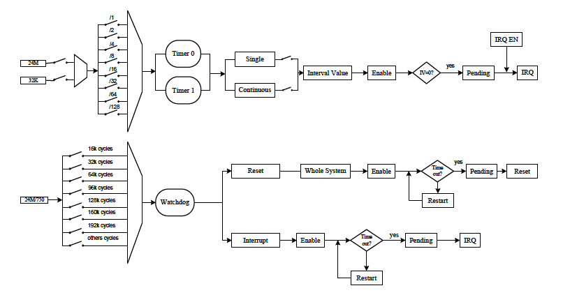

# 3.6 Timer

## 3.6.1 概要

タイマー0/1は32KまたはOSC24Mから入力を得ることができます。これらは
オペレーティングシステムのスケジューラ割り込みを提供します。応答時間の
長いシステムでも短いシステムでも最大限の精度と効率的な管理を提供する
ように設計されています。32ビットのプログラマブルオーバーフローカウンタを
提供し、自動リロードモードまたはリロードなしモードで動作します。
Timer 0 Current ValueレジスタまたはTimer 1 Current Valueレジスタの
現在値がカウントダウンされてゼロになると割り込みイネーブルビットが設定
されている場合、タイマは割り込みを発生します。

ウォッチドッグはノイズやシステムエラーなどの誤動作によって妨害された
コントローラの動作を再開するために使用されます。最大16秒（512,000
サイクル）のウォッチドッグ期間を設定できるダウンカウンタを備えています。
ジェネラルリセットや割り込み要求を発生することができます。

Audio-Video-Sync (AVS)カウンタはプレイヤーのビデオやオーディオの同期に
使用されます。

タイマーモジュールには以下の機能が含まれます。

- 24MHzまたは32KHzのクロックを使用するシステムスケジューラ
  カウンティング用の2つのタイマー
- 各タイマーは個別に割り込みが可能
- システム全体のリセットまたは割り込みを行う1つのウォッチドッグ
- プレイヤーのビデオとオーディオの同期に使用される2つのAVSカウンタ

## 3.6.2 ブロック図

タイマーカウンタのクロック入力は128分周までプリスケール可能な2つの
クロックソースのいずれかから供給されます。シングルモードではカレント値が
0までカウントダウンされるとイネーブルビットが自動的にクリアされ、
タイマーは動作を停止します。連続モードではカウント値が0にカウント
ダウンされるとカレントインターバル値がTImer 0 Current Valueレジスタ/
Timer 1 Current Valueレジスタに自動的に再ロードされ、カレント値
カウンタは新しいインターバル値から再カウントします。カウント値が0に
カウントダウンされるたびにペンディングが生成されます。IRQイネーブル
ビットが設定されている場合のみ、ペンディングはGICまたはR_INTCに送信
されます。

通常、ウォッチドッグはインターバル値内でリスタートされるため、0まで
カウントダウンすることはありません。誤動作によりウォッチドッグが0に
カウントダウンするとペンディングが生成され、リセット（Watchdog Configure
レジスタがシステム全体に構成されている）または割り込み（Watchdog
Configureレジスタが割り込みだけに構成されている）が発生します。

AVSにはアップカウントされる2つのカウンタがあります。カウンタのクロック
ソースは24MHz/Divisor_Nであり、Divisor_NはAVS Counter Divisorレジスタで
設定されます。AVSカウンタはAVS Counter 0レジスタまたはAVS Counter 1
レジスタに設定されたインターバル値とAVS Counter Divisorレジスタに設定
された分周値によって、いつでも一時停止またはイネーブルに変更できます。
AVSカウンタをイネーブルにするとインターバル値から一時停止するまで
カウントアップします。ペンディングは生成しません。



## 3.6.3 動作原理

### 2.6.3.1 タイマーリロードビットとイネーブルビット

一般にリロードビットとイネーブルビットを設定し、Timer 0 Control
レジスタ/Timer 1 Controlレジスタに書き込む操作は危険を伴います。
インターバル値をTimer 0 CUrrent Valueレジスタ/Timer 1 Current Value
レジスタにロードしてからタイマーをイネーブルにするのが良いでしょう。
タイマーが一時停止中の場合にのみ新しいインターバル値からカウンタを
動作させたい場合は、リロードビットとイネーブルビットを1にしてTMR0_CTRL_REG/TMR1_CTRL_REGへ同時に書き込みます。

### 3.6.3.2 タイマーコマンドのタイミング要件

タイマーのリロードとイネーブルの操作は連続操作する場合、何サイクルか
間隔を開ける必要があります。一時停止状態から開始、または、開始状態から
一時停止する場合、少なくとも2サイクル待つ必要があります。また、リロード
操作は前回の操作でリロードビットが自動的にクリアされるまですぐに再実行
することはできません。

### 3.6.3.3 ウォッチドックリスタート

ウォッチドッグリスタート機能はインターバル値内で有効にする必要が
あります。Watchdog Restartに1を、Watchdog Key Fieldに0xA57を同時に
書き込むとリスタートしますが、Watchdog Key Fieldに他の値を書き込むと
無視されます。

## 3.6.4 Timerレジスタリスト

### 基底アドレス

| モジュール名 | 基底アドレス |
|:-------------|:---------------|
| TIMER | 0x01C20C00 |


### レジスタ

| レジスタ名 | オフセット | 記述 |
|:-----------|:-----------|:-----|
| TMR_IRQ_EN_REG | 0x0 | Timer IRQ Enable Register |
| TMR_IRQ_STA_REG | 0x4 | Timer Status Register |
| TMR0_CTRL_REG | 0x10 | Timer 0 Control Register |
| TMR0_INTV_VALUE_REG | 0x14 | Timer 0 Interval Value Register |
| TMR0_CUR_VALUE_REG | 0x18 | Timer 0 Current Value Register |
| TMR1_CTRL_REG | 0x20 | Timer 1 Control Register |
| TMR1_INTV_VALUE_REG | 0x24 | Timer 1 Interval Value Register |
| TMR1_CUR_VALUE_REG | 0x28 | Timer 1 Current Value Register |
| AVS_CNT_CTL_REG | 0x80 | AVS Control Register |
| AVS_CNT0_REG | 0x84 | AVS Counter 0 Register |
| AVS_CNT1_REG | 0x88 | AVS Counter 1 Register |
| AVS_CNT_DIV_REG | 0x8C | AVS Divisor Register |
| WDOG0_IRQ_EN_REG | 0xA0 | Watchdog 0 IRQ Enable Register |
| WDOG0_IRQ_STA_REG | 0xA4 | Watchdog 0 Status Register |
| WDOG0_CTRL_REG | 0xB0 | Watchdog 0 Control Register |
| WDOG0_CFG_REG | 0xB4 | Watchdog 0 Configuration Register |
| WDOG0_MODE_REG | 0xB8 | Watchdog 0 Mode Register |

## 3.6.5 Timerレジスタの説明

## 3.6.6 プログラムガイドライン

### 3.6.6.1 タイマー

タイマー0の1msディレイを例にとると、24Mクロックソース、シングルモード、
2プリスケールがインスタンスで選択される。

```c
writel(0x2EE0, TMR0_INTV_VALUE_REG);    // インターバル地をセット
writel(0x94, TMR0_CTRL_REG);            // シングルモード、24MHzクロークソース, 2プリスケールを選択
writel(readl(TMR0_CTRL_REG)|(1<<1), TMR0_CTRL_REG); // リロードビットをセット
while((readl(TMR0_CTRL_REG)>>1)&1);     // リロードビットがクリアされるまで待機
writel(readl(TMR0_CTRL_REG)|(1<<0), TMR0_CTRL_REG); // Timer0を有効に
```

### 3.6.6.2 ウォッチドック

以下の例ではウォッチドックを次のように構成している。

クロックソースは24M/750、インターバル値は1秒、設定はシステム全体を対象。
インターバル値内の0.5秒後にウォッチドッグをリスタート。

```c
writel(0x1, WDOG_CFG_REG);      // システム全体を対象
writel(0x10, WDOG_MODE_REG);    // インターバル値を1秒にセット
writel(readl(WDOG_MODE_REG)|(1<<0), WDOG_MODE_REG); // ウォッチドックを有効に
delay_ms(500);                  // 500ms待機
writel(readl(WDOG_CTRL_REG)|(0xA57<<1)|(1<<0)，WDOG_CTRL_REG);
                                // Keyフィールドに0xA57を書いてウォッチドックをリスタート
```
