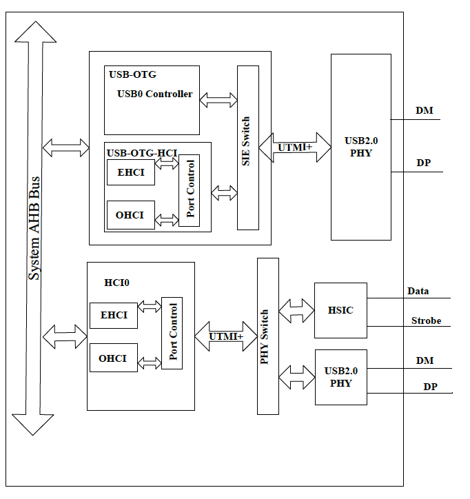

# 7.5 USB

## 7.5.1 USBコントローラのブロック図

## 7.5.2 USB OTG

### 7.5.2.1 概要

USB OTGはデバイスとホストの両機能をサポートするデュアルロールデバイス
コントローラです。ホストだけ、あるいは、デバイスだけのコントローラと
して構成することもできます。USB 2.0仕様に完全に準拠しています。ホスト
モードでは高速転送（HS、480Mbps）、全速転送（FS、12Mbps）、低速転送
（LS、1.5Mbps）をサポートします。デバイスモードでは高速（HS、480-Mbps）と
全速（FS、12-Mbps）をサポートします。UTMI+PHY Level3インタフェースを
介して標準USBトランシーバを使用することができます。UTMI+PHYインタ
フェースは8ビットデータバスによる双方向です。CPUの帯域幅を節約するため
USB-OTG DMAインターフェースはメモリとUSB-OTG FIFO間のデータ転送を行う
外部DMAコントローラをサポートしています。USB-OTGコアはUSBパワーセーブ
機能もサポートしています。

USB2.0 OTGコントローラは次の機能を持っています。

- USB 2.0仕様に準拠
- ホストモードでは高速(HS,480-Mbps)、全速(FS,12-Mbps)、低速(LS,1.5-Mbps)を、デバイスモードでは高速(HS,480-Mbps)、全速(FS,12-Mbps)をサポート
- コントロール転送用に双方向endpoint0をサポート
- バルク、アイソクロナス、インタラプトの各双方向転送用に最大10個の
  ユーザ設定可能なエンドポイントをサポート（エンドポイント1、エンド
  ポイント2、エンドポイント3、エンドポイント4、エンドポイント5）
- エンドポイント用に最大8KBのFIFOをサポート
- 高帯域幅のアイソクロナス転送とインタラプト転送をサポート
- バルク転送でパケットの自動分割/結合をサポート
- ホストモードとデバイスモードの双方でポイント・ツー・ポイント転送と
  ポイント・ツー・マルチポイント転送をサポート
- 自動Ping機能
- ソフト接続/切断機能
- すべてのトランザクションスケジューリングをハードウェアで実行
- UTMI+レベル3インタフェースをサポート。8ビット双方向データバスを使用
- 電力最適化と電力管理機能
- すべてのエンドポイントが外部ノーマルDMAコントローラへのインタフェースを
  持つ

## 7.5.3 USBホスト

### 7.5.3 概要

USBホストコントローラはUSB 2.0仕様、EHCI (Enhanced Host Controller
Interface)仕様 Revision 1.0、OHCI (Open Host Controller Interface)
仕様 Release 1.0aに完全に準拠しています。このコントローラはEHCIホスト
コントローラを使用した高速480Mbps転送（USB 1.1の全速モードの40倍）、
および、1つ以上の統合されたOHCIホストコントローラを使用した全速
および低速転送をサポートしています。

USBホストコントローラは次の機能を持っています。

- 業界標準のAHB（AMBA High-Performanceバス）をサポート。AMBA仕様
  Revision2.0に完全準拠
- レジスタアクセス用に32ビットリトルエンディアンのAMBA AHBスレーブ
  バスをサポート
- メモリアクセス用に32ビットリトルエンディアンのAMBA AHBマスターバスを
  サポート
- メモリとのデータ転送用に内部DMAコントローラを持つ
- EHCI（Enhanced Host Controller Interface）仕様Version 1.0とOHCI
  （Open Host Controller Interface）仕様Version 1.0aに準拠
- 高速（HS, 480-Mbps）、全速（FS, 12-Mbps）、低速（LS, 1.5-Mbps）
  デバイスをサポート
- UTMI+ Level 3インタフェースをサポート。8ビット双方向データバスを使用
- EHCIとOHCIで共有されるUSBルートポートを1つだけサポート

### 7.5.3.2 USBホストタイミング図

USB2.0仕様書、EHCI（Enhanced Host Controller Interface）仕様書Version
1.0、OHCI（Open Host Controller Interface）仕様書Version 1.0aを参照
してください。

### 7.5.3.3 USBホストレジスタリスト

### 基底アドレス

| モジュール名 | 基底アドレス |
|:-------------|:---------------|
| USB_HCI1 | 0x01C1B000 |

### EHCIケーパビリティレジスタ

| レジスタ名 | オフセット | 記述 |
|:-----------|:-----------|:-----|
| E_CAPLENGTH | 0x000 | EHCI Capability register Length Register |
| E_HCIVERSION | 0x002 | EHCI Host Interface Version Number Register |
| E_HCSPARAMS | 0x004 | EHCI Host Control Structural Parameter Register |
| E_HCCPARAMS | 0x008 | EHCI Host Control Capability Parameter Register |
| E_HCSPPORTROUTE | 0x00c | EHCI Companion Port Route Description |

### EHCI操作レジスタ

| レジスタ名 | オフセット | 記述 |
|:-----------|:-----------|:-----|
| E_USBCMD | 0x010 | EHCI USB Command Register |
| E_USBSTS | 0x014 | EHCI USB Status Register |
| E_USBINTR | 0x018 | EHCI USB Interrupt Enable Register |
| E_FRINDEX | 0x01c | EHCI USB Frame Index Register |
| E_CTRLDSSEGMENT | 0x020 | EHCI 4G Segment Selector Register |
| E_PERIODICLISTBASE | 0x024 | EHCI Frame List Base Address Register |
| E_ASYNCLISTADDR | 0x028 | EHCI Next Asynchronous List Address Register |
| E_CONFIGFLAG | 0x050 | EHCI Configured Flag Register |
| E_PORTSC | 0x054 | EHCI Port Status/Control Register |

### OHCI制御・ステータスパーティションレジスタ

| レジスタ名 | オフセット | 記述 |
|:-----------|:-----------|:-----|
| O_HcRevision | 0x400 | OHCI Revision Register |
| O_HcControl | 0x404 | OHCI Control Register |
| O_HcCommandStatus | 0x408 | OHCI Command Status Register |
| O_HcInterruptStatus | 0x40c | OHCI Interrupt Status Register |
| O_HcInterruptEnable | 0x410 | OHCI Interrupt Enable Register |
| O_HcInterruptDisable | 0x414 | OHCI Interrupt Disable Register |

### OHCIメモリポインタパーティションレジスタ

| レジスタ名 | オフセット | 記述 |
|:-----------|:-----------|:-----|
| O_HcHCCA | 0x418 | OHCI HCCA Base |
| O_HcPeriodCurrentED | 0x41c | OHCI Period Current ED Base |
| O_HcControlHeadED | 0x420 | OHCI Control Head ED Base |
| O_HcControlCurrentED | 0x424 | OHCI Control Current ED Base |
| O_HcBulkHeadED | 0x428 | OHCI Bulk Head ED Base |
| O_HcBulkCurrentED | 0x42c | OHCI Bulk Current ED Base |
| O_HcDoneHead | 0x430 | OHCI Done Head Base |

### OHCIフレームカウンタパーティションレジスタ

| レジスタ名 | オフセット | 記述 |
|:-----------|:-----------|:-----|
| O_HcFmInterval | 0x434 | OHCI Frame Interval Register |
| O_HcFmRemaining | 0x438 | OHCI Frame Remaining Register |
| O_HcFmNumbet | 0x43c | OHCI Frame Number Register |
| O_HcPerioddicStart | 0x440 | OHCI Periodic Start Register |
| O_HcLSThreshold | 0x444 | OHCI LS Threshold Register |

### OHCIルートハブパーティションレジスタ

| レジスタ名 | オフセット | 記述 |
|:-----------|:-----------|:-----|
| O_HcRhDescriptorA | 0x448 | OHCI Root Hub Descriptor Register A |
| O_HcRhDescriptorB | 0x44c | OHCI Root Hub Descriptor Register B |
| O_HcRhStatus | 0x450 | OHCI Root Hub Status Register |
| O_HcRhPortStatus | 0x454 | OHCI Root Hub Port Status Register |
