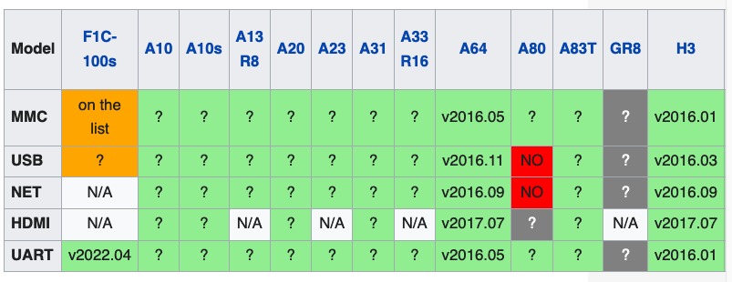
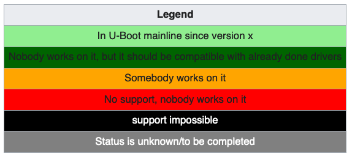

# U-Boot

[オリジナル](https://linux-sunxi.org/U-Boot#Compile_U-Boot)

[U-Boot本家](http://www.denx.de/wiki/U-Boot)における
sunxiデバイスのサポートは増加しています。このページではそのサポートに
ついて説明します。

使用するデバイスがU-Bootでサポートされているか否かは
[各デバイスのページ](https://linux-sunxi.org/Category:Devices)を
ご覧ください。mainline U-Bootをサポートしているすべてのデバイスの
リストは[こちら](https://linux-sunxi.org/Category:Mainline_U-Boot)です。

変更履歴は[こちら](https://linux-sunxi.org/U-Boot/Changelog)で
ご覧いただけます。

[U-Bootのlegacy sunxiブランチ](https://linux-sunxi.org/U-Boot/Legacy_U-Boot)に
ついては別のページがあります。

このドキュメントは主に32ビットのARMデバイス向けです。ARM64用の
違いは[U-Bootのコンパイル](https://linux-sunxi.org/U-Boot#Compile_U-Boot)セクションにのみ記載されています。
詳細についてはubootのソースにある[board/sunxi/README.sunxi64](../others/README.sunxi64_uboot.md)を直接参照してください。

## 現状

この表の目的はlinux-sunxiが行っている各SoCの作業を簡単に見られる
ようにすることです。



- MMCは、SDカードからのブート機能です。
- USBは、USBデバイス（Ethernetドングルなど）を接続する機能です。
- NETは、Ethernet経由でTFTPからブートする機能です。
- HDMIは、HDMI経由でブート画面を表示する機能です。
- UARTは、シリアルコンソールからブート画面を見る機能です。



## U-Bootのコンパイル

###  ツールチェーンの取得

まだインストールしていない場合は、適切な[ツールチェーン](https://linux-sunxi.org/Toolchain)を
インストールしてPATHに追加してください。

また、U-Bootをビルドするにはパッケージをいくつか追加する必要が
あるかもしれません。

```bash
$ apt install swig python-dev
```

`fatal error: Python.h: No such file or directory`が発生した場合は
次を実行してください。

```bash
$ apt install python3-dev
```

### デバイスツリーコンパイラの取得

使用するU-Bootのバージョンによっては最新の _dtc_ が必要になる場合が
あります（古い _dtc_ を使うとビルドプロセスはエラーを発生させ、
アップグレードを要求します）。dtcのインストールについては
[デバイスツリーの記事](https://linux-sunxi.org/Device_Tree#Get_the_Device-tree_Compiler)で説明しています。

U-Bootと共にLinuxカーネルもビルドするのであれば、カーネルソースを
調べてみる価値があるかもしれません。カーネルソースには`${KERNEL_DIR}/scripts/dtc/`以下に _dtc_ が含まれているからです。

### リポジトリのクローン

U-Bootリポジトリは次のコマンドでクローンできます。

```bash
$ git clone git://git.denx.de/u-boot.git
```

> **警告**: 最近追加されたボードやまだ安定版がリリースされていない
> 実験的な機能をテストするのでなければ、安定版リリースを使用することを
> 勧めます。

[以下、省略]

U-Boootのビルドに関しては[board/sunxi/README.sunxi64](../uboot/README.sunxi64_uboot.md)を
参照すること。

## U-Bootの構成
